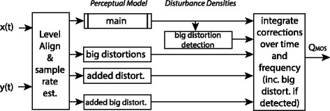
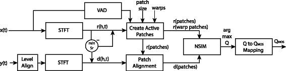

# Audio Quality

Any system that reproduces sound needs to do so with a certain quality.
Such quality can be quantified through conducting experimental evaluations with human evaluations.
These are often called "listening tests" or "subjective evaluations".
The output of such an evaluation is often in the form of an [Mean Opinion Score (MOS)](https://en.wikipedia.org/wiki/Mean_opinion_score).
For some applications standardized tests exists, such as [MUSHRA](https://en.wikipedia.org/wiki/MUSHRA) for intermediate quality audio codecs.
One can carry out such tests oneself using tools like [webMUSHRA](https://github.com/audiolabs/webMUSHRA), or the tests can be performed as a service by professional laboratories such as [FORCE Senselab](https://forcetechnology.com/en/all-industry-facilities/senselab-listening-test-sensory-evaluation).
For an extensive treaty on the topic see the book [Sensory Evaluation of Sound](https://www.routledge.com/Sensory-Evaluation-of-Sound-1st-Edition/Zacharov/p/book/9781498751360).

# Estimating Audio Quality with models

It is also possible to estimate sound quality using computer programs,
using algorithms that model the human perception.
These can be used to compliment, or in some cases replace, subjective evaluations.
Such methods are often referred to as "objective metrics".
These have been developed since at least the early 1990, and have increased performance and complexity over time.
Approaches range from simple calculations using well-known influential factors, to near black-box models learned using artificial neural networks. 

This page gives an overview some of the metrics that are available.

<!-- TODO: an illustration illustrating how this works -->

## Taxonomy

A wide range of metrics exists.

### Use of reference
The reference is the audio before being processed by the system under test.
It may also be called "original", "unprocessed" or similar.

In some usecases or test setups the reference is easily available.
For example when comparing audio codecs, the codec is usually ran on a set of reference material,
and this reference can be used during evaluation.
Metrics making use of the reference is normally called "full reference".
When a reference is used, it is possible for to directly model the *changes* that the system makes to the audio.
 
In others cases the reference is not available, like online estimation of telephone speech quality.
In that case the metric of use must be "reference-free" or "no reference" type.
It is sometimes also called a "non-intrusive" or "single-ended" method.
The changes the system makes is not directly observable.

<!-- TODO: illustrate reference and reference-free -->

### Applications
Some metrics may target specific application areas, and others be of more general nature

- Speech transmission. Telephony, Voice over IP (VoIP), Tele-conferencing
- Wireless sound transmission. Bluetooth devices etc.
- Sound reproduction. Speakers and headphones, concert halls
- Hearing aids, assistive technology.
- Audio Codec development
- Speech Enchancement and Speech Denoising
- Audio Source Separation algorithms
- Speech and Music Synthesis

### Outputs

Some categories of outputs are in common usage

- Speech Intelligibility. How well and how easily can speech be understood 
- Speech Quality. How good does the speech sound
- Audio Quality. How good does the audio sound. Implies wider range of audio than just speech, typically music

The output can designed to an estimate of Mean Opinion Score (MOS) or other quality scale.
Or it can be a dimensionless distance metric whos relationship to subjective ratings must be determined separately.

### Audio channels

Most metrics are monoaural, estimating the quality of a single channel of audio.
A few metrics are specialized to cover binaural and spatial audio.

### Usability as loss function

With deep-learning methods, the objective to optimize for is specified using a loss function.
When building neural networks that should produce perceptually good audio,
the ideal is to incorporate into the loss function.
This normally requires the function to be differentiable.

## Overview

| Method   |      Purpose      |  Open Implementations  | Definition  |
|----------|:-------------:|------:| ------:|
|  PSQM |   Speech Quality  |   |  [ITU-T P.861](https://www.itu.int/rec/T-REC-P.861/en)  |
|  STOI  |  Speech Intelligibility   |  [pystoi](https://github.com/mpariente/pystoi)  | [Paper](https://ieeexplore.ieee.org/document/5495701) |
|  PESQ |  Speech Quality  |  |  [ITU-T P.862](https://www.itu.int/rec/T-REC-P.862/en) |
|  PEAQ |  Audio Quality  | [GstPEAQ](https://github.com/HSU-ANT/gstpeaq)  |  [ITU-R BS.1387-1](http://www.itu.int/rec/R-REC-BS.1387/en)  |
|  POLQA |   Speech Quality | |   [ITU-T P.863](https://www.itu.int/rec/T-REC-P.863/en)  |
|  VISQOL |   Audio/Speech Quality  |  [visqol](https://github.com/google/visqol) |  [Paper](https://arxiv.org/abs/2004.09584) |
|  Frechet Audio Distance |  Audio Quality |  [frechet_audio_distance](https://github.com/google-research/google-research/tree/master/frechet_audio_distance)   |   [Paper](https://arxiv.org/abs/1812.08466) |
|  Just Noticable Differences |  Speech/Audio Quality |   [PerceptualAudio](https://github.com/pranaymanocha/PerceptualAudio)  |  [Paper](https://arxiv.org/abs/2001.04460)  |

## Methods

### PSQM
Perceptual Speech Quality Measure. [wikipedia](https://en.wikipedia.org/wiki/Perceptual_Speech_Quality_Measure)

Voice quality of voice-band (300 – 3400 Hz)  speech codecs.

ITU-T Recommendation [P.861](http://www.itu.int/rec/T-REC-P.861/en) in 1996.
Withdraw. Superseeded by PESQ in 2001.

Cannot account for packet loss, delay variance (jitter) or non-sequential packets. 

### PESQ
Perceptual Evaluation of Speech Quality. [wikipedia](https://en.wikipedia.org/wiki/PESQ)

ITU-T standardized in 2001. https://www.itu.int/rec/T-REC-P.862

Superseeded by POLQA in 2011.

#### Implementations

Standard provides a reference implementation in C.
Only to be used for evaluations, probhibits commercial usage.

https://github.com/ludlows/python-pesq
Python module. Copied original reference C code.

https://github.com/vBaiCai/python-pesq
another Python package. Marked as Work In Progress

#### Limitations

> PESQ was not intended to compare speech before and after noise reduction.
> Its stated aims were to quantify degradation due to codecs and transmission channel errors.
> It was originally tested on speech with environmental noise (i.e., clean original vs. noisy signal)  and was found to correlate well in that case.
 > However, PESQ was found not to correlate with subjective MOS on a number of other tasks (see the standard), 
 > and thus should not be blindly used unless tested first.
[Yaakov J Stein @ research.net](https://www.researchgate.net/post/Is_PESQ_score_a_good_measurement_for_performance_analysis_of_speech_enhancement_algorithms)

### POLQA
[Official website](http://www.polqa.info/)

> The POLQA perceptual measurement algorithm is a joint development of OPTICOM, SwissQual and TNO,
> protected by copyrights and patents and available under license from OPTICOM as software for various platforms.

Latest version is POLQA v3 (2018)

#### Implementations
Available as PolqaOem64 by the standards group.
Requires a license.

#### Usage examples
Used by WebRTC
https://github.com/webrtc-uwp/webrtc/tree/master/modules/audio_processing/test/py_quality_assessment

### VISQOL
Virtual Speech Quality Objective Listener

Originally designed for Speech, but extended to Audio later (VISQOLAudio).
Latest version, VISQOLv3 combines the two variations into one method with a mode switch.

[VISQOLv3 website](https://github.com/google/visqol)

### Implementations

[google/visqol](https://github.com/google/visqol).
Official open-source implementation VISQOLv3.
Commandline tool written in C++.
Cross-platform.

An earlier MATLAB implementation of ViSQOLAudio available is at.
http://www.mee.tcd.ie/~sigmedia/Resources/ViSQOLAudio
https://sites.google.com/a/tcd.ie/sigmedia/visqolaudio

Note: Password protected, must be requested via email.

### Operating principle

### VISQOL paper summary

Based on similarity of spectrograms
Designed to be particularly sensitive to VoIP degradation

> Using a distance metric called the Neurogram Similarity Index Measure or NSIM
> Inspired by Structural Similarity Index (SSIM)
> In this work, spectrograms are treated as images to compare similarity.

> Paper compares quality predictions with PESQ and POLQA for common problems in VoIP:
> clock drift, associated time warping, and playout delays.
> The results indicate that ViSQOL and POLQA significantly outperform PESQ,
> with ViSQOL competing well with POLQA.

> (On speech enhancement algorithms)
> However, these metrics have difficulty with modern communications networks.
> Modern codecs can produce high-quality speech without preserving the input waveform.
> Quality measures based on waveform similarity do not work for these codecs.
> Comparing signals in the spectral domain avoids this problem
> and can produce results that agree with human judgement

### VISQOLAudio paper summary

ViSQOLAudio: An objective audio quality metric for low bitrate codecs
https://asa.scitation.org/doi/full/10.1121/1.4921674?TRACK=RSS
https://research.google/pubs/pub43991/

Moidification of ViSQOL, with Voice Activity Detection removed and wider range of frequency bands.
Bark scale.

- AAC-HE and AAC-LC codecs at four bit rates and examples of MP3 and OPUS codecs
- PEAQ, POLQA, and VISQOLAudio
- compared against the subjective listener test results carried out with headphones
to evaluate their suitability for measuring audio quality for low bit rate codecs

### SDR
Signal to Distortion Ratio.

From the MATLAB toolbox [BSS_eval](http://bass-db.gforge.inria.fr/bss_eval/)

Designed to evaluate (blind) source separation algorithms.

Authors now suggest to use PEASS instead.

### SI-SDR
Scale-invariant SDR (SI-SDR).
Slightly modified definition of SDR, proposed in [SDR – Half-baked or Well Done?](https://ieeexplore.ieee.org/document/8683855).

Corrected version of 'SDR' method from BSS_eval.

### SSI
Speech Intelligibility Index

Only reliable for "simple degradations" (additive noise)

### ANIQUE+

ANIQUE+: A new American national standard for non-intrusive estimation of narrowband speech quality

Claims to be significantly better than ITU-T P.563

### Fréchet Audio Distance
 Abbreviated FAD

Paper: [Fréchet Audio Distance: A Metric for Evaluating Music Enhancement Algorithms](https://arxiv.org/abs/1812.08466).
Published in December, 2018

[Official implementation](https://github.com/google-research/google-research/tree/master/frechet_audio_distance)
[Blogpost announcement](https://ai.googleblog.com/2019/10/audio-and-visual-quality-measurement.html)

Proposed a learned metric for measuring the quality of audio generated by neural networks.
Especially for music enhancement and music generation.

Proposes to use a "standard" training set of studio-grade music recordings.
Can in that way be used reference-free to evaluate new material.
Designed for system evaluation: operates over whole evaluation set of recordings, not per recording.

#### Operating principle

- Audio converted to log- Mel spectrograms
- Using 1 second windows with 0.5 second overlap
- Calculates audio embeddings using a pretrained neural network (VGGish)
- Estimates multivariate Gaussians on embeddings on entire evaluation and reference datasets
- Computes the Fréchet distance between the Gaussians

#### FAD paper notes

Metric eveloped by introducing a wide variety of artificial distortions onto a large dataset of music. 
Magnatagatune dataset. 600 hours of music samples at 16 kHz.

Included distortions:
Low pass, High pass, Reverberation, Pops, Gaussian Noise, Quantization,
Speed up/slow down, Pitch down,
Griffin-Lim (phase) distortions, Mel encoding

Humans rated 69,000 5-second audio clips, 95 hours total. For fitting model.

Evaluations was done on a 25 minute subset. 300 samples a 5 seconds
FAD correlates more closely with human perception than SDR, cosine distance, or magnitude L2 distance.
FAD had a correlation coefficient of 0.52, and others 0.39, -0.15 and -0.01 respectively.

NOTE: weak baselines metrics used in comparison.
Many audio quality metrics that are expected to do better than SDR.

#### Limitations
Based on magnitude mel-filtered spectrograms. Ignores phase

### STOI
Short-time Objective Intelligibility measure.

Proposed in [A short-time objective intelligibility measure for time-frequency weighted noisy speech](https://ieeexplore.ieee.org/document/5495701)

> Intelligibility measure which is highly correlated with the intelligibility of degraded speech signals,
> e.g., due to additive noise, single/multi-channel noise reduction, binary masking and vocoded speech as in CI simulations.
> The STOI-measure is intrusive, i.e., a function of the clean and degraded speech signals.
> 
> STOI may be a good alternative to the speech intelligibility index (SII) or the speech transmission index (STI),
> when you are interested in the effect of nonlinear processing to noisy speech,
> e.g., noise reduction, binary masking algorithms, on speech intelligibility.

#### Operating principle

- Method is based on spectrograms.
- 15, 1/3 octave bands. Covering from 150-4500 Hz.
- 25 ms frames.
- 400 ms windows.
- Compares two spectrograms, using correlation cofficient. ? more details
- Outputs a time-frequency score.
- Overall score is then the average of these.

#### Implementations 

Paper authors provide a MATLAB reference implementation
http://www.ceestaal.nl/code/

https://github.com/mpariente/pystoi
Pure Python implementation.
Python 3 compatible.
Available on PIP.
Has tests against the MATLAB reference.

### ITU P.563
Single-ended method for objective speech quality assessment in narrow-band telephony applications
https://www.itu.int/rec/T-REC-P.563/en

### PEASS
Perceptual Evaluation methods for Audio Source Separation
 [Website](http://bass-db.gforge.inria.fr/peass/)

Provides both perceptually motivated objective measures, as well as some tools for subjective evalutions (MUSHRA).

Paper: [Subjective and objective quality assessment of audio source separation](http://hal.inria.fr/inria-00567152/PDF/emiya2011.pdf)

Implementation in MATLAB.
http://bass-db.gforge.inria.fr/peass/PEASS-Software.html
Licensed as GNU GPLv3

### fwSNRSeg
Frequency-weighted segmental SNR

Has been used for binaural speech intelligibility in [Estimation of binaural intelligibility using the frequency-weighted segmental SNR of stereo channel signals](https://ieeexplore.ieee.org/document/7415459).

#### Implementations
[pysepm](https://github.com/schmiph2/pysepm)
Python package.
Implements many Speech Quality and Speech Intelligibilty metrics.
Including Log-likelihood Ratio.
STOI and PESQ metrics by wrapping pystoi and pypesq

### Just Noticable Differences

[Paper](https://arxiv.org/abs/2001.04460)

### PEMO-Q
PErception MOdel-based Quality estimation

[PEMO-Q - A New Method for Objective Audio Quality Assessment Using a Model of Auditory Perception](https://www.researchgate.net/publication/220655956_PEMO-Q_-_A_New_Method_for_Objective_Audio_Quality_Assessment_Using_a_Model_of_Auditory_Perception)
claims to be better than PEAQ.

Expansion of the speech quality measure qC.

### EAQUAL
Evaluation Of Audio Quality

Based on ITU-R recommendation BS.1387 (PEAQ), and very similar to it.

https://github.com/godock/eaqual

### AMBIQUAL

AMBIQUAL - a full reference objective quality metric for ambisonic spatial audio
https://ieeexplore.ieee.org/document/8463408 

<!--  TODO: import other papers of interest -->
