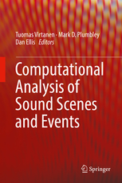

---
author: Jon Nordby @jononor
date: EuroPython 2019, Basel
title: Audio Classification using Machine Learning
width: 1920
height: 1080
margin: 0
css: style.css
---

# Introduction

## Me

Internet of Things specialist

- B.Eng in **Electronics**
- 9 years as **Software** developer. **Embedded** + **Web**
- M. Sc in **Data** Science


## Soundsensing


Sensor Systems for Noise Monitoring

- Supported by Norwegian Research Council
- Pilot project with Oslo Kommune
- Accepted to incubator at StartupLab

## This talk

- Background
- Audio Classification pipeline
- Tips & Tricks
- Pointers to more information

Very practically oriented

TODO: describe scope

Recommended background knowledge

Audio sub-fields

- Speech (Speech Recognition)
- Music (Music Information Retrieval)
- **General** / other

## Why Audio Classification

- Rich source of information
- Any physical motion creates sound
- Sound 
- Good compliment to image/video
- Humans use our hearing

## Example applications

`FIXME: get them`

# Background

## Audio Mixtures

{width=80%}

::: notes

https://www.researchgate.net/profile/Raimund_Dachselt/publication/228715257/figure/fig1/AS:301960805797899@1449004474993/Reverberant-rooms-with-walls-and-openings-For-overlapping-areas-a-parameter-called.png

Channel effects

- Noise
- Frequency response
- Reverberation

:::

<!--

## Human hearing

Two ears (Binaural). Frequencies approx 20Hz - 20kHz. 

A non-linear system

* Loudness is not linear with sound pressure
* Loudness is frequency dependent 
* Compression. Sensitivity lowered when loud
* Masking. Close sounds can hide eachother

::: notes
:::
-->

## Audio acquisition

{width=80%}

## Digital sound representation

* Quantized in time (ex: 44100 Hz)
* Quantizied in amplitude (ex: 16 bit)
* N channels. **Mono**/Stereo
* Uncompressed formats: PCM **.WAV**
* Lossless compression: .FLAC
* Lossy compression: .MP3

# Practical example

## Environmental Sound Classification

> Given an audio signal of environmental sounds,
> 
> determine which class it belongs to

* Widely researched. 1000 hits on Google Scholar
* Open datasets. ESC-50, Urbansound8k (10 classes), AudioSet (632 classes)
* 2017: Human-level performance (on ESC-50)

::: notes

Finite set of classes

https://github.com/karoldvl/ESC-50

:::


## Urbansound8k 

{width=100%}

::: notes 

- Classes from an urban sound taxonomy,
- Based on noise complains in New York City
- Most sounds around 4 seconds.
- Some classes around 1 second
- Saliency annotated  (foreground/background)

:::


# Basic Audio Classification pipeline

## Pipeline

{width=70%}

## Analysis windows

{width=80%}

::: notes

Image:
https://www.researchgate.net/figure/Framing-the-input-audio-signal-into-several-frames-s-s-1-with-appropriate_fig1_332553888

@misc{Sajjad2019,
  author = {Abdoli, Sajjad and Cardinal, Patrick and Koerich, Alessandro},
  year = {2019},
  month = {04},
  pages = {},
  title = {End-to-End Environmental Sound Classification using a 1D Convolutional Neural Network}
}


Hyperparameters:

- Window length
- Window hop / overlap


Depends primarily on how often you want predictions
but beneficial to limit window size:

- lower input dimensionality, easier to learn
- smaller model size
- lower inference time
- lower RAM consumption

+ pretrained image models often want rectangular inputs.
Ex: 128x128

if using a short window compared to label/prediction time,
need to aggregate the predictions somehow

if we want output on a shorter time-basis than labels are available for,
we have a 'weak labeling' scenario

:::

## Mel-filters

{width=80%}

::: notes

Hyperparameters:

- Samplerate
(44.1/48kHz originals. 22kHz commonly used, 16 kHz sometimes)
- Mel filters
- Hop length
- Filter frequency range

(window function: Hann, overlap 50%)

In Python:

- librosa.feature.melspectrogram()
CPU only. Numpy
- Kapre Melspectrogram layer.
GPU. Using Tensorflow STFT operation

:::

## Feature preprocessing

`FIXNE: finish code example`

```python
import librosa

y, sr = librosa.load('audio/0001.wav')
mels = librosa.feature.melspectrogram(y, sr)
```

`TODO: image of chopped spectrogram?`

## Convolutional Neural Network

1: Spectrograms are *image-like* 

2: CNNs are best-in-class for image-classification

=> Will CNNs work well on spectrograms?

<p class="fragment fade-in" style='padding-top: 30px'>Yes!</p>

<p class="fragment fade-in" style='padding-top: 30px'>A bit suprising?</p>

::: notes

Suprising?

- Spectrogram axes not equivalent to eachother.
One is frequency, other is time.
Shifting does not mean the same in each axis.
- No direct ability to model larger frequency patterns (overtones, formants)
- Longer-term time information is lost
- Convolutional Recurrent Neural Networks (CRNN)

Benefits:

- Practices from image classification apply!
Much bigger field.

:::

## SB-CNN

{height=80%,max-width=100%}


::: notes

40 mels
61 frames


:::

## Training setup

Multiple-instance

TimeDistributed in Keras


## Aggregating predictions

* Majority vote
* Mean voting
* Max


# Tips and Tricks


## Normalization

{width=100%}

log-scale compression

Mean-subtract 
Per recording or per analysis window

::: notes

Global clip/dataset analysis for normalization not possible when streaming

:::

## Data Augmentation

{width=100%}

* Adding noise. Random/sampled

::: notes

Mostly done in time-domain,
but can also be done in spectrograms

TODO: mention Mixup

TODO: mention SpecAugment

:::

## Mixup

{height=100%}

::: notes

Xu2018:
https://arxiv.org/abs/1805.07319

:::


## Transfer Learning from images

Pre-trained model ImageNet


- Transfer Learning from image data works OK


`TODO: code example using Keras Applications MobileNet ?`

::: notes

Problem: Images are usually 3 channels (RGB), spectrogram only has 1 channel


:::


## Audio Embeddings

Model pretrained for sound

Look, Listen, Learn ({L^3})

OpenL3

`TODO: code example using OpenL3 ?`

::: notes

Uses a CNN under the hood

Only need to add a simple classifier!
Linear.

??? Could classifying across N frames give good perf.
??? What about adding difference vector

EdgeL3
SoundNet

:::


# Outro

## Summary

Pipeline

- Fixed-length analysis windows
- log-mel spectrograms
- ML model
- Aggregate analysis windows

Models

1. Audio Embeddings (OpenL3) + simple model (scikit-learn)
2. Convolutional Neural Networks with Transfer Learning (ImageNet etc)
3. ... train **simple** CNN from scratch ... 

Data Augmentation

1. Time-shift
2. Time-stretch, pitch-shift, noise-add
3. Mixup, SpecAugment


## Thesis

Environmental Sound Classification on Microcontrollers using Convolutional Neural Networks

[https://github.com/jonnor/ESC-CNN-microcontroller](https://github.com/jonnor/ESC-CNN-microcontroller)


## More learning

Slides and more info: [https://github.com/jonnor/machinehearing](https://github.com/jonnor/machinehearing)

Hands-on: [TensorFlow Speech Recognition tutorial](https://www.tensorflow.org/tutorials/sequences/audio_recognition)

Book: Computational Analysis of Sound Scenes and Events (Virtanen/Plumbley/Ellis, 2018) 

<!--
{width=20%}
-->

## Questions

Slides and more: [https://github.com/jonnor/machinehearing](https://github.com/jonnor/machinehearing)

<h1 style="padding: 100px">?</h1>

Interested in Audio Classification or Machine Hearing generally? Get in touch!

Twitter: @[jononor](https://twitter.com/jononor)

# BONUS

## Audio Event Detection

> Return: time something occurred.

* Ex: "Bird singing started", "Bird singing stopped"
* Classification-as-detection. Classifier on short time-frames
* Monophonic: Returns most prominent event

Aka: Onset detection

::: notes

- Avoid time-shift augmentation

:::

## Segmentation

> Return: sections of audio containing desired class

* Postprocesing on Event Detection time-stamps
* Pre-processing to specialized classifiers


::: notes

Eg: Extract only birdcall audio, then perform bird species identification

- Can alternatively be done unsupervised
- Can be real-time / single-pass, or multi-pass

:::

## Tagging

> Return: All classes/events that occurred in audio.

Approaches

* separate classifiers per 'track'
* joint model: multi-label classifier


## Streaming

Real-time classification

`TODO: document how to do in Python`

<!--

## Creating datasets

::: notes

Use lossless compression
Make sure autogain is off (smartphones)

Make a plan for how to record

Capture information about recording setup.
Recording equipment. Recording settings.
System under test.
Environmental conditions.
Take pictures.
Keep a written log of things that happen during recording.
Timestamp important events.

:::

-->

## Annotating audio

{width=100%}

```python
import pandas

labels = pandas.read_csv(path, sep='\t', header=None,
                        names=['start', 'end', 'annotation'],
                        dtype=dict(start=float,end=float,annotation=str))
```

::: notes

- Use Audacity
- Label track
- Keyboard shortcuts to add
- Annotation file is a basic CSV
- Tools. Editing. Spectrogram view. Noise removal

:::


## Mel-Frequency Cepstral Coefficients (MFCC)

* MFCC = DCT(mel-spectrogram)
* Popular in Speech Detection
* Compresses: 13-20 coefficients
* Decorrelates: Beneficial with linear models 

On general audio, with strong classifier, performs worse than log mel-spectrogram

## End2End learning

Using the raw audio input as features with Deep Neural Networks.

Need to learn also the time-frequency decomposition,
normally performed by the spectrogram. 

Actively researched using advanced models and large datasets.

`TODO: link EnvNet`


