---
author: Jon Nordby <jon@soundsensing.no>
date: March 25, 2021
css: style.css
width: 1920
height: 1080
margin: 0
pagetitle: 'Sound Event Detection with Machine Learning'
---

<section class="titleslide level1" data-background-image="./img/soundsensing-withlogo.jpg" style="background: rgba(255, 255, 255, 0.3); padding-top: 1.7em;" >

<h1 style="">Sound Event Detection with Machine Learning</h1>

<p>
Jon Nordby</br>
Head of Data Science & Machine Learning</br>
Soundsensing AS</br>
jon&#64;soundsensing.no</br>
</br>
EuroPython 2021</br>
</p>

</section>

::: notes

Hi and good morning everyone

Jon Nordby
Head of Machine Learning and Data Science at Soundsensing

Today we will be talking about
Sound Event Detection using Machine Learning

:::


# Introduction

::: notes


:::

## About Soundsensing

{width=100%}

::: notes

Soundsensing is a company that focuses on audio and machine learning.

We provide easy-to-use IoT sensors that can continiously measure sound,
and use Machine Learning to extract interesting information.

The information presented in our online dashboard,
and is also available in an API for integrating with other systems.

Our products are used for Noise Monitoring
and Condition Monitoring of equipment.

:::

## Sound Event Detection

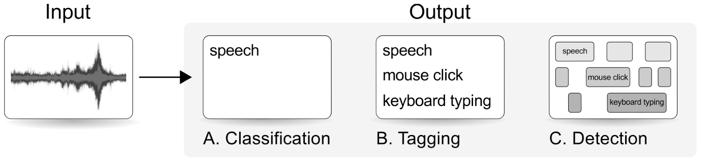{width=100%}

> Given input audio </br>
> return the timestamps (start, end) </br>
> for each event class


::: notes

One of many common tasks in Audio Machine Learning

Other examples of tasks are Audio Classification, and Audio Tagging

In Classification there is only a single class label as output. No timing information 
In Tagging one allows multiple classes. But also no timing information.
Event Detection gives a series of time-stamps as output

Also known as: Acoustic Event Detection or Audio Event Detection (AED)

Audio Classification with Machine Learning (Jon Nordby, EuroPython 2019)
https://www.youtube.com/watch?v=uCGROOUO_wY

:::

## Events and non-events

Events are sounds with a clearly-defined duration or onset.

| Event (time limited)    | Class (continious) |
| ----------- | ----------- |
| Car passing      |  Car traffic       |
| Honk      |  Car traffic       |
| Word   |  Speech   |
| Gunshot   |  Shooting   |

::: notes

What are events?

Start-end. Onset/offset
Or at least a clear start

Isolated claps (event) versus clapping (ongoing, class)

If events are overlapping a lot, might not make sense as events anymore

For events one can count the number of occurrences
Classification might instead count number of seconds instead

:::


# Application

Fermentation tracking when making alcoholic beverages.
Beer, Cider, Wine, etc. 

::: notes

Tried to pick a bit fun task as an example

:::

## Alcohol is produced via fermentation

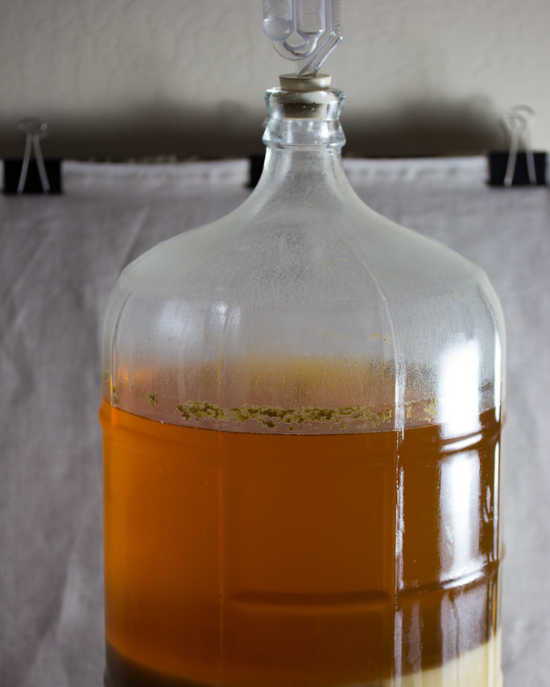{width=30%}

::: notes

When brewing alcoholic beverages
such as beer, cider or wine
one puts together a compoud with yeast, source of sugars, water (the wort)
into a vessel

The vessel is put in a location with an appropriate temperature,
and after some time the fermentation process will start.

During fermentation the yeast will eat the sugar,
which will produce alcohol, and as a byproduct also CO2 gas

There are many things that can go wrong.
- can fail to start
- way to intense: foaming, blowout
- abrupt stop

So as a brewer, one has to monitor the process.

At the top of the vessel you see an airlock.
This is a device that will let the CO2 gas out,
while not allowing oxygen, bugs or other contaminants in.

:::

## Airlock activity

<video data-autoplay src="videos/!-j7md-wkL1U0.mp4" controls style="height: 800px"></video>

<!--
<iframe src="https://www.youtube.com/watch?v=j7md-wkL1U0" controls width="1500" height="1000"/></iframe>
-->

::: notes

In this video clip the fermentation process has started, with medium activity

CO2 is being pushed through the airlock, and escapes out at the top

As you can hear this makes a characteristic sound,
a "plop" for each bubble of gas that escapes 

This example has a very nice and clear sound. 
It is not always so nice.

This is something we can track using Machine Learning.
We can have a microphone that picks up the sound,
pass it through some software and use a machine learning model to
detect each individual "plop"

Example of an event.
Clear time-defined sound that we want to count.

If you count the plop or bubbling activity
then you can estimate how much fermentation is going on.
Can also be used to estimate alcohol content, though it is not very precise for that.
It can tell at least whether fermentation has started or not,
and roughly how the brew is progressing.

:::

## Fermentation tracking

Fermentation activity can be tracked as Bubbles Per Minute (BPM).

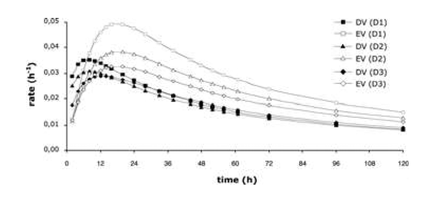{width=80%}

::: notes

Typical curves look like this.
Starts out with nothing, then ramps up.
And as the yeast eats up the sugars, fermentation will gradually go down.

Many variations in the curves possible depending on your brew, some examples shown here.

Affected by temperature, external and in the brew.
And of the changes over time in sugar and yeast concentrations.

:::

## Our goal

Make a system that can track fermentation activity,
</br>outputting Bubbles per Minute (BPM),
</br>by capturing airlock sound using a microphone,
</br>using Machine Learning to count each "plop"

::: notes

Of course there are existing devices dedicated to this task. 
Such as a Plaato Airlock.
But for fun and learning we will do this using sound.
This is an Sound Event Detection problem

:::


# Machine Learning needs Data!

::: notes

When one says "Machine Learning"
many people think think mainly about ML algorithms and code
But just as important, or in many cases more important, is the **data**

Without appropriate data for your task,
you will not get a good ML model,
or ML powered system!

:::

## Supervised Machine Learning

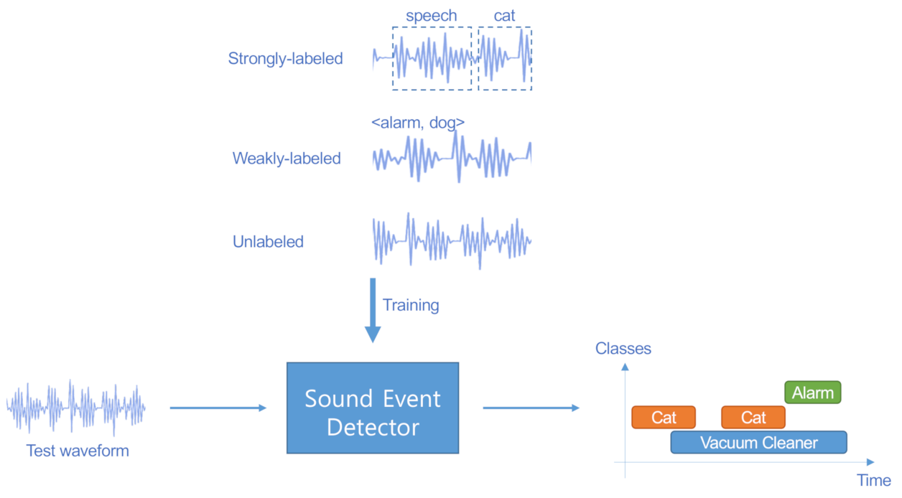{width=80%}

::: notes

The technique we are going to use is Supervised learning, which is the most common for learning
a classifier or detector like this. 

Supervised learning is based on labeled examples,
of Input (Audio) AND Expected output (bubble yes/no) 

In sound event detection there are multiple ways of labeling your data.
We will work here with strongly labeled data (shown at the top),
where the start and end of each event instance is marked.
Very detailed. Takes a considerable amount of time to make, but easy for a system to learn from.

So the labeled data will go into the training system,
and output a Sound Event Detector.
This detector can be ran on new audio, and will output detected events,
in our case the plops.

TODO: mark only the relevant case in image

:::

<!--
As an alternative you can have weakly labeled data.
This is when you have a longer audio clip, maybe 10 seconds or more,
and you have noted which kinds of events are present in the clip,
but not marked where they are, or how many events the are.
This is less time-consuming to make.
But means that there is much less information available for the machine learning algorithm,
so this is more challenging task.

One can also use unlabled data for learning.
But even then you will usually need some labels, to evaluate performance.
-->

## Data requirements: Quantity

Need *enough* data. 

| Instances per class   | Suitability |
| ----------- | ----------- |
| 100    |  Minimal       |
| 1000      |  Good      |
| 10000+   |  Very good  |

::: notes

What are the requirements for the data?

One requirement is that we have enough data.
This varies a lot, depending on complexity of the problem. But here are some rough guidelines.

100 events. Couple of minutes.
When you split out a test set from this, might only have 30 instances there. 
Can be used as a start.
But will be hard to work with, because you will have a lot of variation in statistics.

1000 events. Approx 1 hour.
Can have a couple of hundred events in the test sets.
Reasonable for low to medium complexity tasks.

10000 events. Tens of hours.
Best case. Then one has robust statistics.

:::

## Data requirements: Quality

Need *realistic* data. Capturing natural variation in

- the event sound
- recording devices used
- recording environment

::: notes

But the other important thing is to have *realistic* data

Variations in event sound.
Different airlock designs and vessels cause different sound 
Different brews, and phases of fermentation process cause differences
The recording devices also have variation, changes the captured sound

Also have different environments
Need to separate the events of interest, from the background noise
There might be other people and activities in the room,
or sounds coming in from other rooms or outside.
Such variation need to be represented in our dataset,
so that we know that our model will handle them well
- and not confuse other sounds for "plops"

:::


## Check the data

<video data-autoplay src="videos/eda-audacity.mkv" controls style="height: 800px"></video>

::: notes

Data collected via Youtube

!! Only show 2-3 examples

2 group
Much lower in the frequency

3 group
Even more noise.
Machine in the background
Starting to be hard to hear

4 
again different sound
car in the background

5 
two plops at the same time
events that overlap can be very challening
especially if very similar, can be practically impossible

6
first a plop
then a sound that in spectrogram looks quite similar
but actually is something different
can be very easily confused

:::

## Understand the data

Note down characteristics of the sound

- Event length
- Distance between events
- Variation in the event sound
- Changes over time
- Differences between recordings
- Background noises
- Other events that could be easily confused

::: notes

Always inspect and explore the data!

Listen to audio, look at spectrogram.

Length. Around 200 milliseconds
Distance. Varies based on activity 
Variations. Another type of airlock design, 3-part. Makes much less sound
Time changes. Very high
Rec differences.

TODO, make into a table for this case

:::


## Labeling data manually using Audacity

{width=80%}

```python
import pandas

labels = pandas.read_csv(path, sep='\t', header=None,
                        names=['start', 'end', 'annotation'],
                        dtype=dict(start=float,end=float,annotation=str))
```


::: notes
Audacity open source audio editor
Supports "label tracks"

Select an area in time
Hit Ctrl B to add a label
T for true. Event of interst
N for no. Other events
Can also mark other sounds, events/activities that are ongoing
Can be useful for error analysis

Can be exported as a text file
Can be read easily with Pandas, as shown in this example code

:::

<!--

"How to Label Audio for Deep Learning in 4 Simple Steps"
Miguel Pinto, TowardsDataScience.com
https://towardsdatascience.com/how-to-label-audio-for-deep-learning-in-4-simple-steps-6a2c33b343e6

Shows how to use Audacity to label.
Including switching to spectrograms,
annotating a frequency range,
exporting the labels to files,
and importing the label files in Python.

-->

# Machine Learning system

::: notes

Now that we have data, labeled and checked
we can go over to the model part

:::

## Audio ML pipeline overview

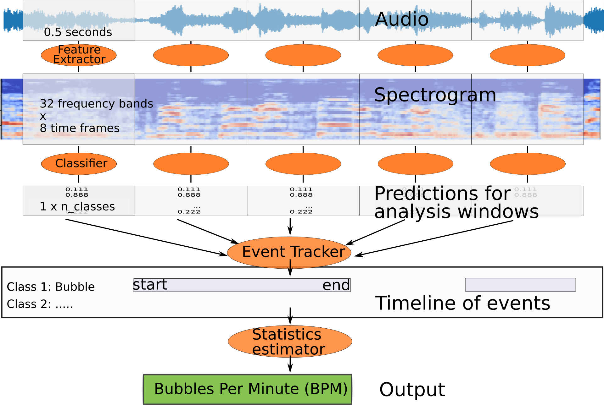{width=60%}

::: notes

Split the audio into fixed-length windows.

Compute some features. For example a spectrogram.

Each spectrogram window will go into a classifier.

Outputs a probability between 0.0 and 1.0.

Event tracker converts the probability into a discrete list of event starts/stops.

Count these over time to estimate the Bubbles per Minute.

:::

<!--
Single audio stream. Monophonic.
Single event class. Binary classification

Uniform probability of event occuring.
Not considering sequences, or states, in the detector
Ie in speech recognition certain sequences of phonemes are more probable

Requires that each event is clearly audible and understandable - without context
Low-to-no overlap between events.
-->

## Spectrogram

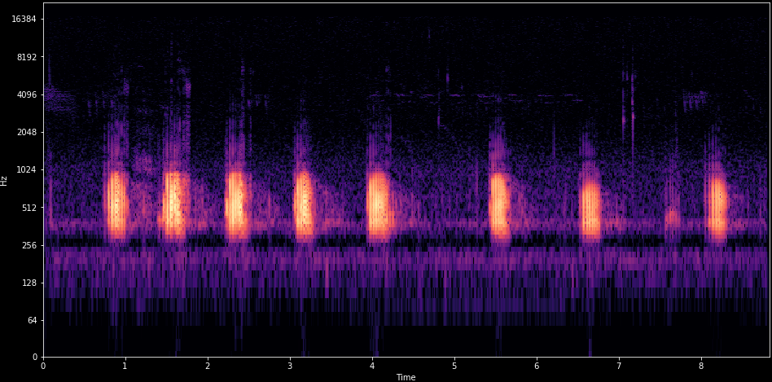{width=50%}

```python
import librosa

audio, sr = librosa.load(path)
spec = librosa.feature.melspectrogram(y=audio, sr=sr)
spec_db = librosa.power_to_db(spec, ref=np.max)

lr.display.specshow(ps_db, x_axis='time', y_axis='mel')
```

::: notes

Also in Pytorch Audio, Tensorflow et.c.

:::


## CNN classifier model

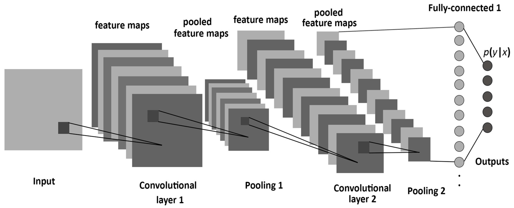{width=60%}

```python
from tensorflow import keras
from keras.layers import Convolution2D, MaxPooling2D

model = keras.Sequential([
        Convolution2D(filters, kernel,
                      input_shape=(bands, frames, channels)),
        MaxPooling2D(pool_size=pool),
....
])

```

::: notes

If you are unfamiliar with deep learning,
can also try a simple Logistic Regression on MFCC,
with scikit-learn.
Might do OK for many tasks!

Once the pipeline is setup, with 
A large amount of different kind of models can work well

:::

<!--

-->

<!--
Trick: Normalization. Window-based. Median or max.

Trick: Include delta features
-->


## Evaluation

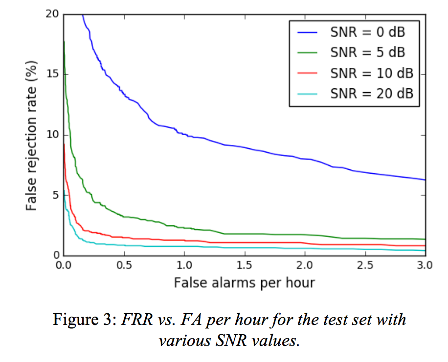{width=80%}

::: notes

Multiple levels

Window-wise
- False Positive Rate / False Negative Rate
- Precision / recall

Might be overly strict. Due to overlap, can afford to miss a couple of windows 

Should be able to miss a couple of events without loosing track of the BPM

:::

<!--
- Event-wise evaluation
using sed-eval

TODO: include evaluation of BPM. Per

- Blops per Minute
Errors within +- 10%?

LATER: include slide on dataset splitting.
Grouped split in scikit-learn

:::

<!--
Results

Detection performance

LATER: results on windows
precision/recall or TPR/FPR curve

LATER: Results on BPM
-->

## Event Tracker

Converting to discrete list of events

- Threshold the probability from classifier
- Keep track of whether we are currently in an event or not

```python
    if not inside_event and probability >= on_threshold:
        inside_event = True
        print('EVENT on', t, probability)
    if inside_event and probability <= off_threshold:
        inside_event = False
        print('EVENT off', t, probability)
```

::: notes

Using separate on/off threshold avoids
noise/oscillation due to minor changes around the threshold value.
Called hysteresis

:::

## Statistics Estimator

To compute the Bubbles Per Minute

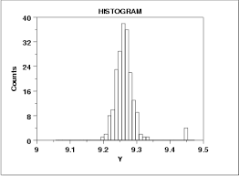{width=30%}

- Using the typical time-between-events
- Assumes regularity
- Median more robust against outliers

::: notes

Could just count events over 1 minute and report as-is.
However our model will make some mistakes. 
Missed events, additional events.

Since we have a very periodic and slowly changing process,
can instead use the distance between events.

Can have outliers. If missing event, or false triggering.
Take the median value and report as the BPM. 

:::

<!---
TODO: update with real picture

Median filtering.
Reject time-difference values outside of IQR.

Maybe give a range.
Confidence Interval of the mean
Student-T extimation

-->


## Tracking over time using Brewfather

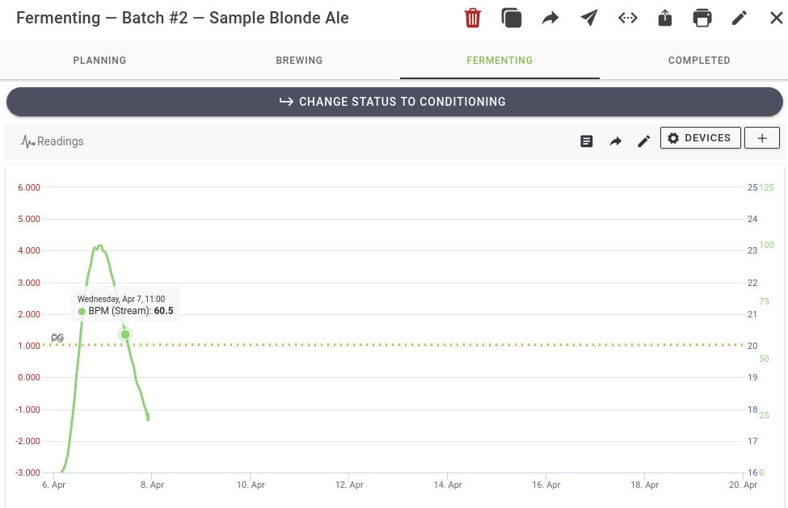{width=50%}

```python
# API documentation: https://docs.brewfather.app/integrations/custom-stream
import requests

url = 'http://log.brewfather.net/stream?id=9MmXXXXXXXXX'
data = dict(name='brewaed-0001', bpm=CALCULATED-BPM)
r = requests.post(url, json=data)
```

::: notes

LATER. Edit picture to make less tall

:::


# Outro

## More resources

</br>
Github project: [jonnor/brewing-audio-event-detection](https://github.com/jonnor/brewing-audio-event-detection)

</br>
General Audio ML: [jonnor/machinehearing](https://github.com/jonnor/machinehearing)

* [Sound Event Detection: A tutorial](https://arxiv.org/abs/2107.05463). Virtanen et al.
* [Audio Classification with Machine Learning](https://www.youtube.com/watch?v=uCGROOUO_) (EuroPython 2019)
* [Environmental Noise Classification on Microcontrollers](https://www.youtube.com/watch?v=ks5kq1R0aws) (TinyML 2021)

</br>
Slack: [Sound of AI community](https://valeriovelardo.com/the-sound-of-ai-community/)

## What do you want make?

Now that you know the basics of Audio Event Detection with Machine Learning in Python.

- Popcorn popping
- Bird call
- Cough
- Umm/aaa speech patterns
- Drum hits
- Car passing

::: notes

Not-events.
Alarm goes off.
Likely to persist (for a while)

:::


## Continious Monitoring using Audio ML

Want to deploy Continious Monitoring with Audio?</br>
Consider using the Soundsensing sensors and data-platform.

{width=80%}

</br>
<em>Get in Touch! contact&#64;soundsensing.no</em>

::: notes

- Built-in cellular connectivity.
- Rugged design for industrial and outdoor usecases.
- Can run Machine Learning both on-device or in-cloud
- Supports Sound Event Detection, Audio Classification, Acoustic Anomaly Detection

:::

## Join Soundsensing

</br>Want to work on Audio Machine Learning in Python?</br>
We have many opportunities.

- Full-time positions
- Part-time / freelance work
- Engineering thesis
- Internships
- Research or industry partnerships

</br>
<em>Get in Touch! contact&#64;soundsensing.no</em>

::: notes


:::


## {data-background="./img/soundsensing-withlogo.jpg" style="background: rgba(255, 255, 255, 0.3);"}


<h1>Questions ?</h1>

</br>
<em>
Sound Event Detection with Machine Learning</br>
EuroPython 2021
</em>

</br>
<p>
Jon Nordby
</br>jon&#64;soundsensing.no
</br>Head of Data Science & Machine Learning
</p>


# Bonus

Bonus slides after this point

<!-- TODO: Maybe include some of this in main talk -->


## Semi-automatic labelling

Using a Gaussian Mixture, Hidden Markov Model (GMM-HMM)

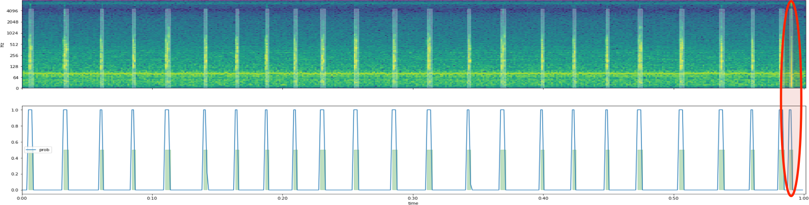{width=80%}

```python
import hmmlearn.hmm, librosa, sklearn.preprocessing

features = librosa.feature.mfcc(audio, n_mfcc=13, ...)
model = hmmlearn.hmm.GMMHMM(n_components=2, ...)
X = sklearn.preprocessing.StandardScaler().fit_transform(data)
model.fit(X)
probabilities = model.score_samples(X)[1][:,1]
```

::: notes

Unsupervised learning. Does not need any labels.
Compute statistics, try to cluster into 2 groups.
Event and background
Can work quite well when the events are quite clear.

Workflow.
First running it, generating label files
Then reviewing and editing the labels in Audacity

from hmmlearn
https://github.com/hmmlearn/hmmlearn
Using Mel-Frequency-Cepstral-Coefficiants as features
Lossy compression on top of a mel-spectrogram

:::


## Synthesize data

How to get more data</br>without gathering "in the wild"?

- Mix in diffent kinds of background noise.
- Vary Signal to Noise ratio etc
- Useful to estimate performance on tricky, not-yet-seen data
- Can be used to compensate for small amount of training data
- *scaper* Python library: [github.com/justinsalamon/scaper](https://github.com/justinsalamon/scaper)

::: notes

Challenge in Acoustic Event Detection in uncontrolled environment.

Handling the largs amounts of different background noises that could occur.

:::

## Streaming inference

Key: Chopping up incoming stream into (overlapping) audio windows

```python
import sounddevice, queue

# Setup audio stream from microphone
audio_queue = queue.Queue()

def audio_callback(indata, frames, time, status):
    audio_queue.put(indata.copy())

stream = sounddevice.InputStream(callback=audio_callback, ...)
...

# In classification loop
    data = audio_queue.get()
    # shift old audio over, add new data
    audio_buffer = numpy.roll(audio_buffer, len(data), axis=0)
    audio_buffer[len(audio_buffer)-len(data):len(audio_buffer)] = data
    new_samples += len(data)
    # check if we have received enough new data to do new prediction
    if new_samples >= hop_length:
        p = model.predict(audio_buffer)
        if p < threshold:
            print(f'EVENT DETECTED time={datetime.datetime.now()}')
```

::: notes

Brewer does not really care about each and every blop
BPM changes slowly and (normally) quite evenly, and does not have to be reported often
Brewfather limits updates to once per 15 minutes

Detection time.
Delay between sound event happening and detection being performed and reported
How quickly someone needs to see/use result
Some applications may short detection time

But real-time streaming detection can be useful to verify detection when setting up. 
And makes for nicer demo :)

LATER: video demo? can just be console output, while input audio is playing

:::

## Event Detection with Weakly Labeled data

Can one learn Sound Event Detection
</br>without annotating the times for each event?
</br>
</br>Yes!

- Referred to as *weekly labeled* Sound Event Detection
- Can be tackled with *Multiple Instance Learning*
- Inputs: Audio clips consisting of 0-N events
- Labels: True if any events in clip, else false
- Multiple analysis windows per 1 label
- Using temporal pooling in Neural Network

::: notes

TODO, maybe expand on this, show example code

Active area of research. DCASE
Speech recognition systems. Can give phone level output with sentence-level annotations 

Multiple Instance Learning
Principle model architecture with neural networks
Each (overlapped) analysis window in a clip goes through same neural network.
Outputs are pooled across time to make prediction of event present-or-not.
Common pooling operation: max, or softmax
More advanced. Attention pooling, or Autopool (softmax generalization)

:::

## Data collection via Youtube

Criteria for inclusion:

- Preferably couple of minutes long, minimum 15 seconds 
- No talking to the camera
- Mostly stationary camera
- No audio editing/effects
- One or more airlocks bubbling
- Bubbling can be heard by ear

Approx 1000 videos reviewed, 100 usable

::: notes

Making note of

- Bubbling rate
- Clarity of bubble sound
- Other noise around

Maybe 1000 videos reviewed.
End up with around 100 potentialy useful
Many hours of work

Up to 100 recording devices and 100 environments. Maybe 2000 events
Some recordings very long, several hours. Maybe 5000 events

Using youtube-dl to download
youtube-dl --extract-audio $URL

https://youtube-dl.org/
https://github.com/ytdl-org/youtube-dl/

:::

## Characteristics of Audio Events

- Duration
- Tonal/atonal
- Temporal patterns
- Percussive
- Frequency content
- Temporal envelope
- Foreground vs background
- Signal to Noise Ratio

::: notes

Some events are short
Gunshot
Bark

Some are bit longer
Cat mjau

Some events are percussive / atonal.
Cough, etc

Some have temporal patterns
Some are more tonal
Alarms

Transitions. Into state. Out of state.

:::

## Analysis windows

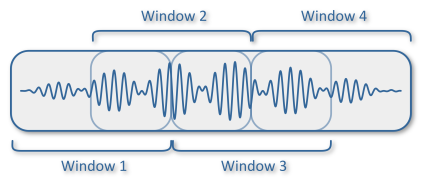{width=50%}

Window length bit longer than the event length.

Overlapping gives classifier multiple chances at seeing each event.

Reducing overlap increases resolution! Overlap for AES: 10%

::: notes


:::


