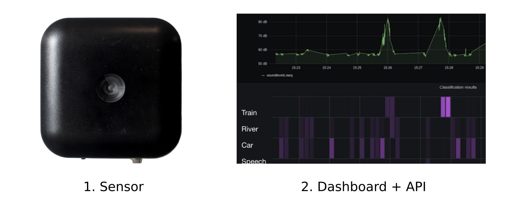
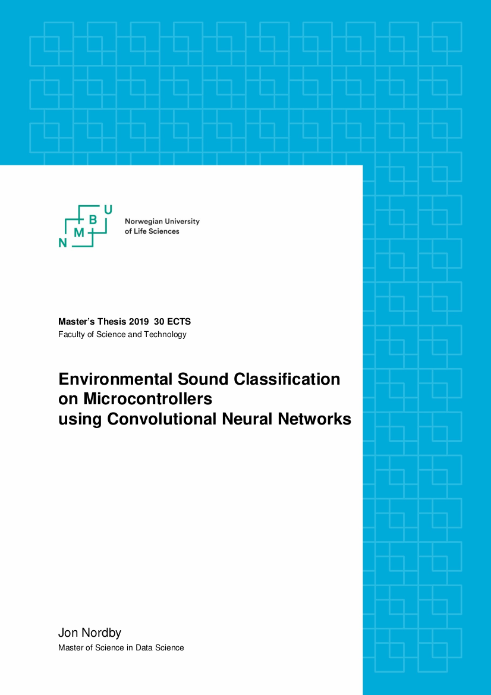

---
author: Jon Nordby <jon@soundsensing.no>
date: March 25, 2021
css: style.css
width: 1920
height: 1080
margin: 0
pagetitle: 'Audio Event Detection with Machine Learning'
---

<section class="titleslide level1" data-background-image="./img/soundsensing-withlogo.jpg" style="background: rgba(255, 255, 255, 0.3); padding-top: 1.7em;" >

<h1 style="">Audio Event Detection with Machine Learning</h1>

Jon Nordby 
Head of Data Science & Machine Learning 
Soundsensing AS 
jon&#64;soundsensing.no 
 
Python for ML and AI, Global Summit 2021, by Geekle 

</section>

# Introduction

::: notes

Jon Nordby
Head of Machine Learning and Data Science at Soundsensing
An IoT sensor company that specializes in Audio Machine Learning

:::

## About Soundsensing

{width=100%}

::: notes

We provide easy-to-use IoT sensors that can continiously measure sound,
and use Machine Learning to extract interesting information.

The information presented in our online dashboard,
and is also available in an API for integrating with other systems.

Our products are used for Noise Monitoring
and Condition Monitoring of equipment.

:::

## Audio Event Detection

Also known as: Acoustic Event Detection (AED) and Sound Event Detection (SED)

Audio Classification with Machine Learning (Jon Nordby, EuroPython 2019)
https://www.youtube.com/watch?v=uCGROOUO_wY

::: notes

TODO: image/table. Examples of events and non-events

Related to Audio Classification

Events need to have a well-defined duration
Start-end. Onset/offset
Or at least a clear start

If events are overlapping a lot, might not make sense as events anymore
Isolated claps (event) versus clapping (ongoing, class)

For events one can count the number of occurrences
Classification might instead count number of seconds instead

:::

## Brewing alcohol

{width=50%}

IMAGE: fermentation vessel with airlock

AUDIO/VIDEO: airlock plopping

::: notes

When brewing alcoholic beverages
such as beer, cider or wine
one puts together a compoud with yeast and (the wort)
into a vessel

After some hours or days the fermentation starts
CO2 is produced by the yeast eating the sugars
The Co2 escapes the tank through the airlock
and this makes an audible "plop" 

:::

## Fermentation tracking

Fermentation activity can be tracked as Bubbles Per Minute (BPM).

IMAGE: fermentation activity graph over time

Goal:
Make a system that can track fermentation activity (BPM),
by using Machine Learning to count the airlock "plops".

::: notes

Several things can go wrong with the fermentation

- fails to start
- is too active. Blowout
- stops abruptly

Affected by temperature, external and in the brew.
And of the changes over time in suger and yeast concentrations.

So brewers try to check in a couple of times per day how things are going.

Of course there are existing devices dedicated to this task. 
Such as a Plaato Airlock.
But for fun and learning we will do this using sound.

This is an Audio Event Detection problem

The fermentation activity can also be an estimator for the alcohol produced.
Though measuring the specific gravity is better for this.

:::

## Supervised Machine Learning

Based on examples.
Input (Audio).
Expected output (bubble yes/no) 

TODO: find an image

# Data Collection

## Data requirements

Need *enough* data. Instances per class

- 100. Minimal
- 1000. Good
- 10000+ Very good 

Need *realistic* data. Capturing natural variation in

- the event sound
- recording devices used
- recording environment

::: notes

TODO: make a table?

100 events. Couple of minutes of data
1000 events. Approx 1 hour
10000 events. Tens of hours

Especially if there are other event-like noises

:::

## Data collection via Youtube

Criteria for inclusion:

- Preferably couple of minutes long, minimum 15 seconds 
- No talking
- Mostly stationary camera
- No audio editing/effects
- One or more airlocks bubbling
- Bubbling can be heard by ear

Approx 1000 videos reviewed, 100 usable

::: notes

Making note of

- Bubbling rate
- Clarity of bubble sound
- Other noise around

Maybe 1000 videos reviewed.
End up with around 100 potentialy useful
Many hours of work

Up to 100 recording devices and 100 environments. Maybe 2000 events
Some recordings very long, several hours. Maybe 5000 events

Using youtube-dl to download
youtube-dl --extract-audio $URL

https://youtube-dl.org/
https://github.com/ytdl-org/youtube-dl/

:::

## Exploratory Data Analysis

IMAGE: spectrograms in Audacity

VIDEO? many events from different clips. 1 second each

Note characteristics of the sound

- Event length
- Distance between events
- Variation in the event sound
- Changes over time
- Differences between recordings
- Background noises
- Other events that could be easily confused

::: notes

Always inspect and explore the data!

Listen to audio, look at spectrogram.

Audacity, open-source software for audio editing

:::

## Labeling data manually using Audacity

IMAGE: Audacity with labels

"How to Label Audio for Deep Learning in 4 Simple Steps"
Miguel Pinto, TowardsDataScience.com
https://towardsdatascience.com/how-to-label-audio-for-deep-learning-in-4-simple-steps-6a2c33b343e6

::: notes
Audacity open source audio editor
Supports "label tracks"

Shows how to use Audacity to label.
Including switching to spectrograms,
annotating a frequency range,
exporting the labels to files,
and importing the label files in Python.

:::

## Semi-automatic labelling

Using a Gaussian Mixture, Hidden Markov Model (GMM-HMM)

IMAGE: detected labels. Maybe Audacity track at bottom
TODO: code example? Or mention hmmlearn

::: notes

First running it, generating label files
Then reviewing and editing the labels in Audacity

from hmmlearn
https://github.com/hmmlearn/hmmlearn
Using Mel-Frequency-Cepstral-Coefficiants as features
Lossy compression on top of a mel-spectrogram

:::

# Machine Learning system

## Audio ML pipeline

AED as classification of short independent time-windows.

::: notes

Single audio stream. Monophonic.
Single event class. Binary classification

Uniform probability of event occuring.
Not considering sequences, or states, in the detector
Ie in speech recognition certain sequences of phonemes are more probable

Requires that each event is clearly audible and understandable - without context
Low-to-no overlap between events.

:::

## Analysis windows

Bit longer than the event length

Overlap maybe at 10%

::: notes

:::

## Evaluation

Multiple levels

Window-wise
- False Positive Rate / False Negative Rate
- Precision / recall

Might be overly strict. Due to overlap, can afford to miss a couple of windows 

- Event-wise

- Blops per Minute
Errors within +- 10%?

::: notes

Should be able to miss a couple of events without loosing track of the BPM
But short clips of just some seconds will have some spread probably

:::

## Models

Baseline simple. Logistic Regression on MFCC
Advanced. CNN/RNN on spectrogram

::: notes

Once the pipeline is setup, with 
A large amount of different kind of models can work well

Trick: Normalization. Window-based. Median or max.

Trick: Include delta features

:::

## Post-processing

Counting.
Threshold the probability above X

Median filtering.
Reject time-difference values outside of IQR.

Event rate. Count / time

Maybe give a range.
Confidence Interval of the mean
Student-T extimation

# Results

## Detection performance

IMAGE: precision/recall or TPR/FPR curve

Results on BPM

## Tracking over time

Integration with Brewfather

TODO: image of graph in Brewfather

::: notes

:::

## Streaming inference

Key: Chopping up incoming stream into (overlapping) audio windows

TODO: code example?

TODO: video demo?

::: notes

Brewer does not really care about each and every blop
BPM changes slowly and (normally) quite evenly, and does not have to be reported often
Brewfather limits updates to once per 15 minutes

But real-time streaming detection can be useful to verify detection when setting up. 
And makes for nicer demo :)

:::

# Outro

## What will you make?

Now that you know the basics of Audio Event Detection with Machine Learning in Python.

- Popcorn popping
- Bird call
- Cough
- Umm/aaa speech patterns
- Drum hits
- Car passing

::: notes

Not-events.
Alarm goes off.
Likely to persist (for a while)

:::

## Continious Monitoring using Audio ML

Want to deploy Continious Monitoring with Audio? 
Consider using the Soundsensing sensors and data-platform.

 Want to work on Audio Machine Learning in Python? 
Join our team at Soundsensing.

 
<em>Get in Touch! contact&#64;soundsensing.no</em>

::: notes

- Built-in cellular connectivity.
- Rugged design for industrial and outdoor usecases.
- Can run Machine Learning both on-device or in-cloud
- Supports Audio Event Detection, Audio Classification, Audio Anomaly Detection

:::

## {data-background="./img/soundsensing-withlogo.jpg" style="background: rgba(255, 255, 255, 0.3);"}

<h1>Questions ?</h1>

 
<em>
Audio Event Detection with Machine Learning 
Python for ML and AI, Global Summit 2021, by Geekle
</em>

 

Jon Nordby
 jon&#64;soundsensing.no
 Head of Data Science & Machine Learning

# Bonus

Bonus slides after this point

## More resources

Machine Hearing. ML on Audio

[github.com/jonnor/machinehearing](https://github.com/jonnor/machinehearing)

## Synthesize data

How to get more data without gathering in the wild?

- Mix in diffent kinds of background noise.
- Vary Signal to Noise ratio etc
- Useful to estimate performance on tricky, not-yet-seen data
- Can be used to compensate for small amount of training data
- *scaper* Python library: [github.com/justinsalamon/scaper](https://github.com/justinsalamon/scaper)

::: notes

Challenge in Acoustic Event Detection in uncontrolled environment.
Handling the largs amounts of different background noises that could occur.

:::

## Event Detection with Weakly Labeled data

Can one learn Audio Event Detection
 without annotating the times for each event?
 
 Yes!

- Referred to as *weekly labeled* Audio Event Detection
- Can be tackled with *Multiple Instance Learning*
- Inputs: Audio clips consisting of 0-N events
- Labels: True if any events in clip, else false
- Multiple analysis windows per 1 label
- Using temporal pooling in Neural Network

::: notes

Active area of research. DCASE
Speech recognition systems. Can give phone level output with sentence-level annotations 

Multiple Instance Learning
Principle model architecture with neural networks
Each (overlapped) analysis window in a clip goes through same neural network.
Outputs are pooled across time to make prediction of event present-or-not.
Common pooling operation: max, or softmax
More advanced. Attention pooling, or Autopool (softmax generalization)

:::

## Characteristics of Audio Events

- Duration
- Tonal/atonal
- Temporal patterns
- Percussive
- Frequency content
- Temporal envelope
- Foreground vs background
- Signal to Noise Ratio

::: notes

Some events are short
Gunshot
Bark

Some are bit longer
Cat mjau

Some events are percussive / atonal.
Cough, etc

Some have temporal patterns
Some are more tonal
Alarms

Transitions. Into state. Out of state.

:::

## Mel-spectrogram

## Environmental Sound Classification on Microcontrollers

> Environmental Sound Classification
> on Microcontrollers
> using Convolutional Neural Networks

Master thesis, Jon Nordby, 2019.

{width=30%}

