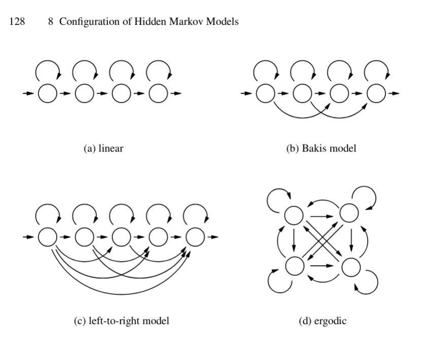

# Constrained Hidden Markov Models

Hidden Markov Model are simple but powerful learners for sequential data
(including time-series, genetic sequences et.c.),
and are especially useful in unsupervised learning setting.

When prior knowledge about state transition patterns are available,
these can be used to impose constraints on the state transitons
when learning a model from the data.
A common usecase is to forbid/remove some transitions,
to enforce a simpler model.

## General approach

Principle: On each step of the learning loop, modify the transition matrix to fit the contraints.
This can either be a hard assignment, or a softer regularization term.

This requires access to the steps of the learning loop, and to be able to modify the transitions.
Not all existing implementations of Hidden Markov Models make this easy,
but we provide some code examples for established Python libraries below.

Note: messing with the learning loop will impact the learning process in general,
so proper model validation is needed.
If constraints are infeasible the convergence may fail.
There topology changes is espected to interact with other hyper-parameters, such as learning rate.

## Implementations

For examples of contrained HMMs using
[hmmlearn](https://github.com/hmmlearn/hmmlearn)
and [pomegranate](https://github.com/jmschrei/pomegranate) Python libraries,
see [ConstrainedHMM.ipynb](./ConstrainedHMM.ipynb).

The neccesary code is intended to be copied and modified as needed to suit a particular purpose.
There are no plans for a generic software library.
If the needs are strong enough, we recommend that the functionality is added to the HMM libraries themselves.

## Special cases

Several topologies with particular constraints have been defined.
This include (a) linear model, (b) Bakis model, (c) left-to-right model, and (d) ergodic model.

Image from [Markov Models for Pattern Recognition, pp 127–136](https://link.springer.com/chapter/10.1007/978-3-540-71770-6_8).

Sequentia [supports linear, ergodic and left-right topologies](https://sequentia.readthedocs.io/en/latest/sections/classifiers/gmmhmm.html#model-topologies) for its GMM-HMM implementation.
It is achieved by the transition matrix being fully specified by the topology, and not learned from data [(code)](https://github.com/eonu/sequentia/blob/master/lib/sequentia/classifiers/hmm/gmmhmm.py#L102).

## Uses of constrained HMMs

Some references of uses of the contraints in Hidden Markov Model.

- [A transition-constrained discrete hidden Markov model for automatic sleep staging](https://biomedical-engineering-online.biomedcentral.com/articles/10.1186/1475-925X-11-52).
By Shing-Tai Pan, Chih-En Kuo, Jian-Hong Zeng & Sheng-Fu Liang.
August, 2012.
Used contraints on the transitions to encode a model for sleep stages, based on domain knowledge.
For example, from Wake state, have to go through stages called S1 and S2 before being able to enter RWS (deep sleep) or REM (deep sleep) states.
- [Semi-supervised Constrained Hidden Markov Model Using Multiple Sensors for Remaining Useful Life Prediction and Optimal Predictive Maintenance](https://www.researchgate.net/publication/349500297_Semi-supervised_Constrained_Hidden_Markov_Model_Using_Multiple_Sensors_for_Remaining_Useful_Life_Prediction_and_Optimal_Predictive_Maintenance_for_Remaining_Useful_Life_Prediction_and_Optimal_Predicti)
Xinyu ZhaoYunyi KangHao YanHao YanFeng JuFeng Ju.
September, 2019.
Evaluated on NASA Engine degradation data.
Using a semi-supervised left-to-right constrained Hidden Markov Model (HMM) model,
where start state is beginning of use, and end state is failure.
HMM states capturing degradation in condition dynamics.
On top of this builds a Partial Observable Markov Decision Process (POMDP),
for predictive maintenance.
Modify the EM algorithm of the HMM learning based on the left-to-right constraint,
and the monotonicity constraint in the multiple-sensor setting.
- [Constrained hidden Markov models for population-based haplotyping](https://bmcbioinformatics.biomedcentral.com/articles/10.1186/1471-2105-8-S2-S9)
Niels Landwehr, Taneli Mielikäinen, Lauri Eronen, Hannu Toivonen & Heikki Mannila.
May, 2007.
Proposes a HMM with transition contraints to satisfy the Hardy-Weinberg equilibrium assumption.
- .
Combined acoustic emission and vibration sensors.
Used an HMM with 3 states; Entry, In-progress, Exit; and only allowing the transitions Entry -> In-progress -> Exit (in addition to self transitions).
Computing an anomaly score from the differences in log probabiliis between model fitted early in machine lifetime.

