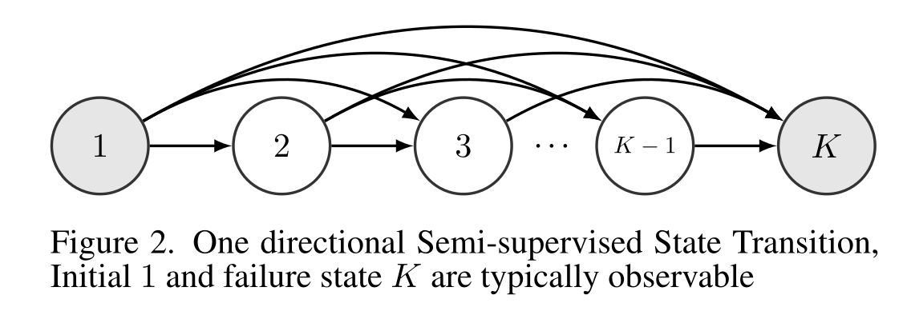

# Constrained Hidden Markov Models

[Hidden Markov Models](https://en.wikipedia.org/wiki/Hidden_Markov_model) are simple but powerful learners for sequential data
(including time-series, genetic sequences et.c.),
and are especially useful in unsupervised learning setting.

When prior knowledge about state transition patterns are available,
these can be used to impose constraints on the state transitons
when learning a model from the data.
A common usecase is to forbid/remove some transitions,
to enforce a simpler model.

## Established topologies

Several topologies with common types of constraints have been defined.
This include (a) linear model, (b) Bakis model, (c) left-to-right model, and (d) ergodic model.


Image from [Markov Models for Pattern Recognition, pp 127–136](https://link.springer.com/chapter/10.1007/978-3-540-71770-6_8).

Some real-world examples are referenced at the bottom of this page.

## TODO

- Provide an example on real data.
For example fitting a repeated sequential (cyclic) process, such as those found in automation/manufacturing.

## Implementation

## General approach

Principle: On each step of the learning loop, modify the transition matrix to fit the edge/transition contraints.
This can either be a hard assignment, or a softer regularization term.

This requires access to the steps of the learning loop, and to be able to influence the transitions.
Not all existing implementations of Hidden Markov Models make this easy,
but we provide some code examples for established Python libraries below.

Note: If constraints are infeasible the convergence may fail.
There topology changes is espected to interact with other hyper-parameters, such as learning rate.


### pomegranate

Since 1.0 (April 2024), the [pomegranate](https://github.com/jmschrei/pomegranate) Python library,
has explicit support for constructing HMMs by predefining the edges.
The learning process can update the defined edges, or one can freeze some edges, or all edges.
This should provide sufficient flexibility for most cases of constrained HMMs.
The library also supports many different kinds of distributions/mixtures.

Specifying initial transition/edge probabilities is done by using `model.add_edge()`.

NOTE: leaving out an edge seems to cause problems, NaNs while learning.
Specifying 0.0 as probability also fails, with an exception.
Instead set a very small probability, like `1e-6`.

To adjust to which degree the edge probabilities get updated, it is important to specify `inertia` in the model constructor.
The default value of 0.0 means the specified edges will just be fully overwritten by the first E-M iteration.
It is also possible to use the `frozen` attributes to fully freeze/lock a parameter.

See [ConstrainedHMM.ipynb](./ConstrainedHMM.ipynb) for a full example.

This approach of specifying edges *should* work both for the DenseHMM and SparseHMM, according to documnetation.
But as of June 2025, I (Jon) was only able to get it working for DenseHMM.
More testing is needed.

### Sequentia

Sequentia supports `linear`, `ergodic` and `left-right` topologies out-of-the-box
for its [GMM-HMM implementation](https://sequentia.readthedocs.io/en/latest/sections/models/hmm/variants/gaussian_mixture.html).

It is achieved by the transition matrix being fully specified by the topology, so no probabilities can be learned from data.
It seems that hmmlearn is used internally.


#### hmmlearn
With the [hmmlearn](https://github.com/hmmlearn/hmmlearn) Python library,
doing constrains on the transition matrix can be done easily (if a bit hacky),
by subclassing and overriding the `_do_mstep` method, and manipulating `self.transmat_`.

NOTE: messing with the learning loop will impact the learning process in general,
so extra careful model validation is recommeded.

```python
class ConstrainedGaussianHMM(hmmlearn.hmm.GaussianHMM):
    def _do_mstep(self, stats):
        
        # do the standard HMM learning step
        super()._do_mstep(stats)
                
        # NOTE: the mapping of state indices to the data is nondeterministic
        # so you should find a heuristic to identify the correct ones
        s2 = 1, s3 = 2

        # manipulate the transition matrix as you see fit
        self.transmat_[s2,s3] = 0.0
```
See [ConstrainedHMM.ipynb](./ConstrainedHMM.ipynb) for a full example.


## Uses of constrained HMMs

Some references of uses of the contraints in Hidden Markov Model.

- [A transition-constrained discrete hidden Markov model for automatic sleep staging](https://biomedical-engineering-online.biomedcentral.com/articles/10.1186/1475-925X-11-52).
By Shing-Tai Pan, Chih-En Kuo, Jian-Hong Zeng & Sheng-Fu Liang.
August, 2012.
Used contraints on the transitions to encode a model for sleep stages, based on domain knowledge.
For example, from Wake state, have to go through stages called S1 and S2 before being able to enter RWS (deep sleep) or REM (deep sleep) states.
- [Semi-supervised Constrained Hidden Markov Model Using Multiple Sensors for Remaining Useful Life Prediction and Optimal Predictive Maintenance](https://www.researchgate.net/publication/349500297_Semi-supervised_Constrained_Hidden_Markov_Model_Using_Multiple_Sensors_for_Remaining_Useful_Life_Prediction_and_Optimal_Predictive_Maintenance_for_Remaining_Useful_Life_Prediction_and_Optimal_Predicti)
Xinyu ZhaoYunyi KangHao YanHao YanFeng JuFeng Ju.
September, 2019.
Evaluated on NASA Engine degradation data.
Using a semi-supervised left-to-right constrained Hidden Markov Model (HMM) model,
where start state is beginning of use, and end state is failure.
HMM states capturing degradation in condition dynamics.
On top of this builds a Partial Observable Markov Decision Process (POMDP),
for predictive maintenance.
Modify the EM algorithm of the HMM learning based on the left-to-right constraint,
and the monotonicity constraint in the multiple-sensor setting.
- [Constrained hidden Markov models for population-based haplotyping](https://bmcbioinformatics.biomedcentral.com/articles/10.1186/1471-2105-8-S2-S9)
Niels Landwehr, Taneli Mielikäinen, Lauri Eronen, Hannu Toivonen & Heikki Mannila.
May, 2007.
Proposes a HMM with transition contraints to satisfy the Hardy-Weinberg equilibrium assumption.
- [Online milling tool condition monitoring with a single continuous hidden Markov models approach](https://www.extrica.com/article/15019).
Combined acoustic emission and vibration sensors.
Used an HMM with 3 states; Entry, In-progress, Exit; and only allowing the transitions Entry -> In-progress -> Exit (in addition to self transitions).
Like a linear topology, but without allowing cycling.
Computing an anomaly score from the differences in log probabilities between model fitted early in machine lifetime.

.

.


