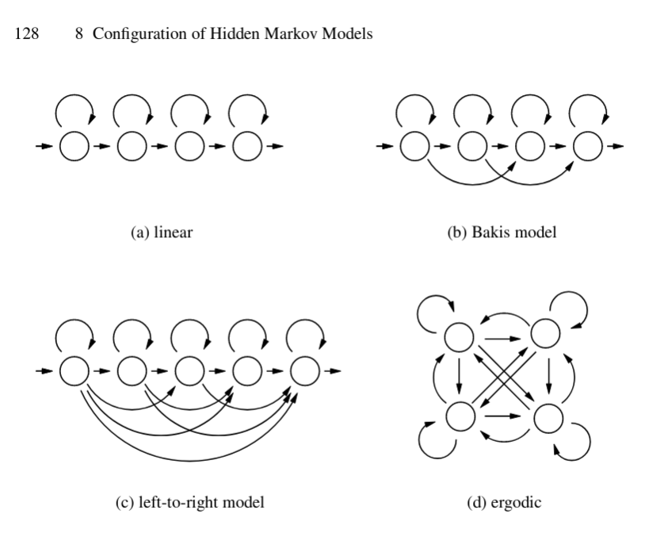

# Constrained Hidden Markov Models

Given that one has data which is well described by a sequence of states
and also the prior knowledge about state transitions,
it may be desirable to impose constraints on the state transitons
when learning a model from the data.

## Special cases

Several topologies with particular constraints have been defined.
This include (a) linear model, (b) Bakis model, (c) left-to-right model, and (d) ergodic model.

[Markov Models for Pattern Recognition, pp 127–136](https://link.springer.com/chapter/10.1007/978-3-540-71770-6_8).

Sequentia [supports linear, ergodic and left-right topologies](https://sequentia.readthedocs.io/en/latest/sections/classifiers/gmmhmm.html#model-topologies) for its GMM-HMM implementation.
It is achieved by the transition matrix being fully specified by the topology, and not learned from data [(code)](https://github.com/eonu/sequentia/blob/master/lib/sequentia/classifiers/hmm/gmmhmm.py#L102).
This is implemented on top of hmmlearn.

## Existing code support

FIXME: find any code, paper or formula that describes how to do it?

## Our approach

Principle: On each step of the learning loop, modify the transition matrix to fit our contraints.
Can be a hard change, or a softer regularization.

XXX: may interact with learning rate
XXX: may cause convergence to fail

This requires access to the steps of the learning loop, and to be able to modify the transitions.

In `hmmlearn`, the HMM models have an internal method `_do_mstep()` which is called on each iteration.
https://github.com/hmmlearn/hmmlearn/blob/d16c7c851b60e934729eb40ce5ef01164e13a813/lib/hmmlearn/hmm.py#L1171

In `pomegranate`, the HMM models have a public callback API.
The callback `on_epoch_end` is called on each iteration.
https://github.com/jmschrei/pomegranate/blob/f115a242a5b50854bbf199d43fe2cfd061e9708a/pomegranate/hmm.pyx#L2715
The callback gets the model instance as self.model before on_training_begin
But there is no way to get or set the transitions during training, as they are C arrays inside Cython
Clean solution would be to expose an optional callback for modifying this.
Otherwise have to stick to the workaround from https://github.com/jmschrei/pomegranate/issues/9

In `sequentia`, the models just use hmmlearn internally, so one would need to use the hmmlearn approach there.

## Test-case

Periodic waveform going up/down gradually.
Triangle/sinewave. With some additive noise.
low=s1,medium=s2,high=s3
Constraint such that s1->s2 and/or s2->s3 is not allowed, but s3->s2->s1 is allowed.
Expected: should jump s1->s3 direct when going up, but go s3->s2->s1 when going down.
Show results with/without constraints.
Maybe do n=NNN iterations, to make sure it is not initialization dependent.

## Uses of constrained HMMs

TODO: refer to some papers etc that do this, and the purpose/effect

- [Semi-supervised Constrained Hidden Markov Model Using Multiple Sensors for Remaining Useful Life Prediction and Optimal Predictive Maintenance: for Remaining Useful Life Prediction and Optimal Predictive Maintenance](https://www.researchgate.net/publication/349500297_Semi-supervised_Constrained_Hidden_Markov_Model_Using_Multiple_Sensors_for_Remaining_Useful_Life_Prediction_and_Optimal_Predictive_Maintenance_for_Remaining_Useful_Life_Prediction_and_Optimal_Predicti)
Xinyu ZhaoYunyi KangHao YanHao YanFeng JuFeng Ju.
September, 2019.
Evaluated on NASA Engine degradation data.
Using a semi-supervised left-to-right constrained Hidden Markov Model (HMM) model,
where start state is beginning of use, and end state is failure.
HMM states capturing degradation in condition dynamics.
On top of this builds a Partial Observable Markov Decision Process (POMDP),
for predictive maintenance.
Modify the EM algorithm of the HMM learning based on the left-to-right constraint,
and the monotonicity constraint in the multiple-sensor setting.

## Others that want to do this

- https://github.com/jmschrei/pomegranate/issues/9
- https://stackoverflow.com/questions/63675733/how-to-train-a-hidden-markov-model-with-constrained-probabilities-or-missing-li
