---
title: Environmental Sound Classification on microcontrollers
author: Jon Nordby <jon@soundsensing.no>
date: November 19, 2019
css: style.css
width: 1920
height: 1080
margin: 0
pagetitle: 'TinyML Summit 2021: Environmental Sound Classification on microcontrollers'
---

# Introduction

## Jon Nordby

Internet of Things specialist

- B.Eng in **Electronics**
- 9 years as **Software** developer. **Embedded** + **Web**
- M. Sc in **Data** Science

Now:

- CTO at Soundsensing
- Machine Learning Consultant

## Soundsensing

{width=100%}

::: notes
Provide **Noise Monitoring** and Audio **Condition Monitoring** solutions
that are used in Real-Estate, Industry, and Smart Cities.

Perform Machine Learning for sound classification **on sensor**.
:::

## Dashboard

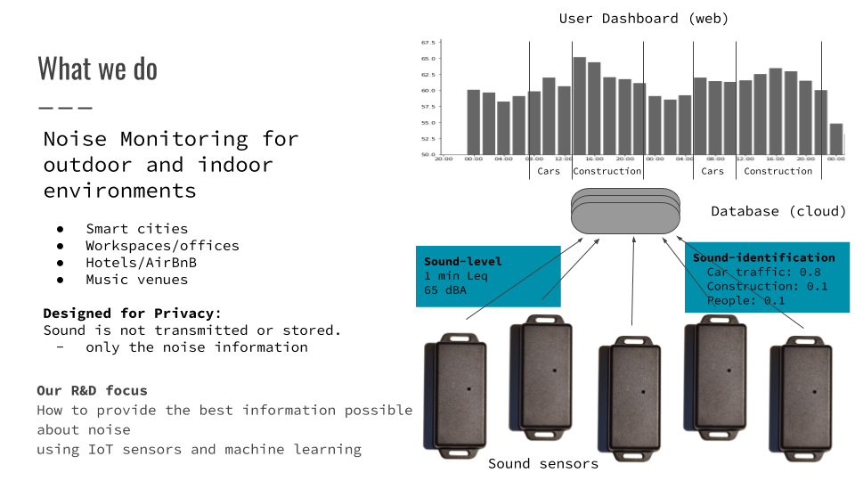

## Thesis

> Environmental Sound Classification
> on Microcontrollers
> using Convolutional Neural Networks

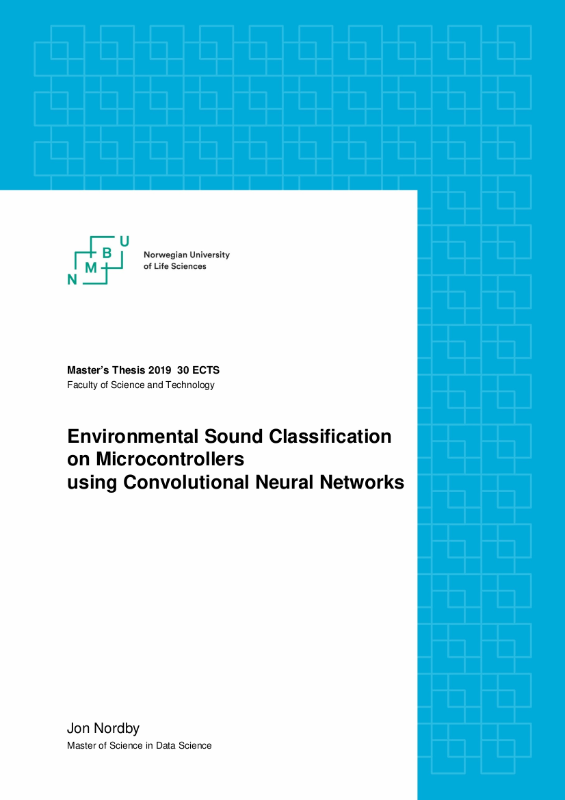{width=30%}

## Wireless Sensor Networks

- Want: Wide and dense coverage
- Need: Sensors need to be low-cost
- **Opportunity**: Wireless reduces costs
- **Challenge**: Power consumption

::: notes

* No network cabling, no power cabling
* No site infrastructure needed
* Less invasive
* Fewer approvals needed
* Temporary installs feasible
* Mobile sensors possible

Electrician is 750 NOK/hour

Image: https://www.nti-audio.com/en/applications/noise-measurement/unattended-monitoring
:::

## Sensor Network Architectures

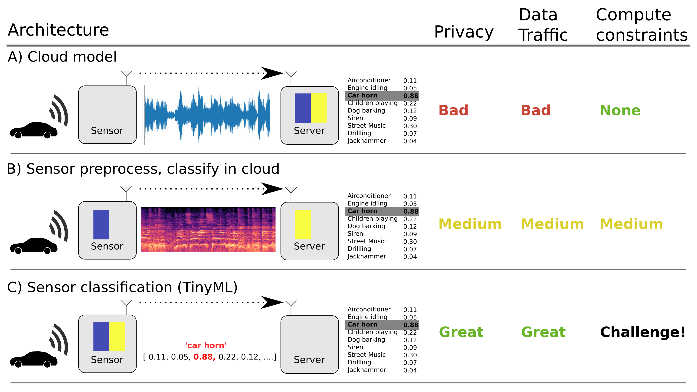{width=70%}

# Audio Machine Learning on low-power sensors 

## What do you mean by low-power?

Want: 1 year lifetime for palm-sized battery

Need: `<1mW` system power

## General purpose microcontroller

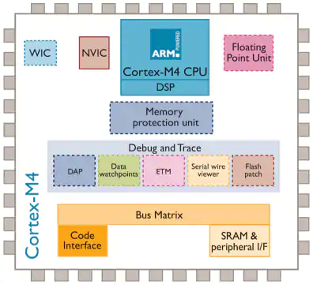{width=40%}

STM32L4 @ 80 MHz. Approx **10 mW**.

- TensorFlow Lite for Microcontrollers (Google)
- ST X-CUBE-AI (ST Microelectronics)

## FPGA

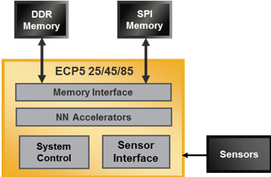{width=50%}

Human presence detection. VGG8 on 64x64 RGB image, 5 FPS: 7 mW.

Audio ML approx **1 mW**

## Neural Network co-processors

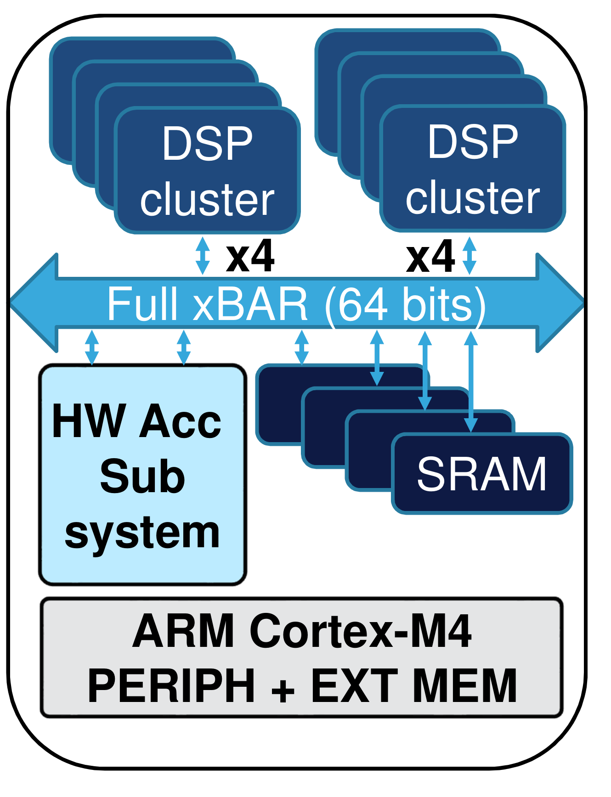{width=25%}

2.9 TOPS/W. AlexNet, 1000 classes, 10 FPS. 41 mWatt

Audio models probably **< 1 mWatt**. 

::: notes

https://www.latticesemi.com/Blog/2019/05/17/18/25/sensAI

:::

# On-edge Classification of Noise

## Environmental Sound Classification

> Given an audio signal of environmental sounds,
> 
> determine which class it belongs to

* Widely researched. 1000 hits on Google Scholar
* Datasets. Urbansound8k (10 classes), ESC-50, AudioSet (632 classes)
* 2017: Human-level performance on ESC-50

::: notes

https://github.com/karoldvl/ESC-50

:::

<!--

## Microcontroller

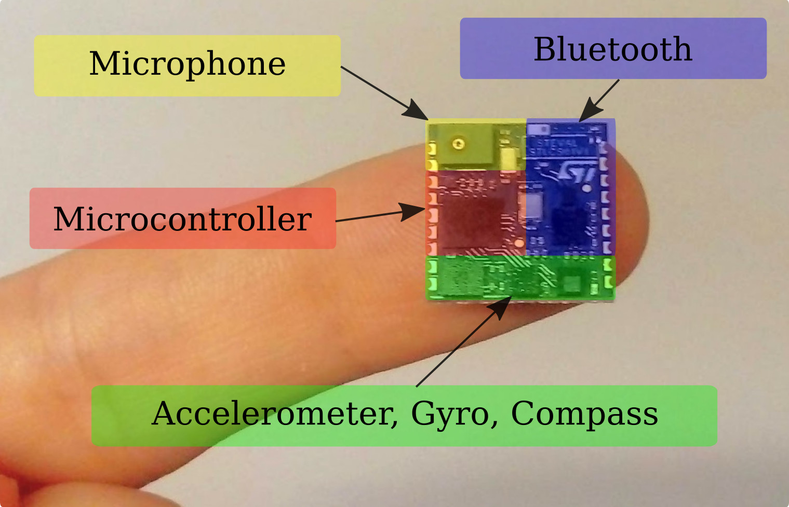{width=100%}

-->

::: notes

STM32L476

ARM Cortex M4F
Hardware floating-point unit (FPU)
DSP SIMD instructions
80 MHz CPU clock 
1024 kB of program memory (Flash)
128 kB of RAM.

25 mWatt max

:::

## Urbansound8k 

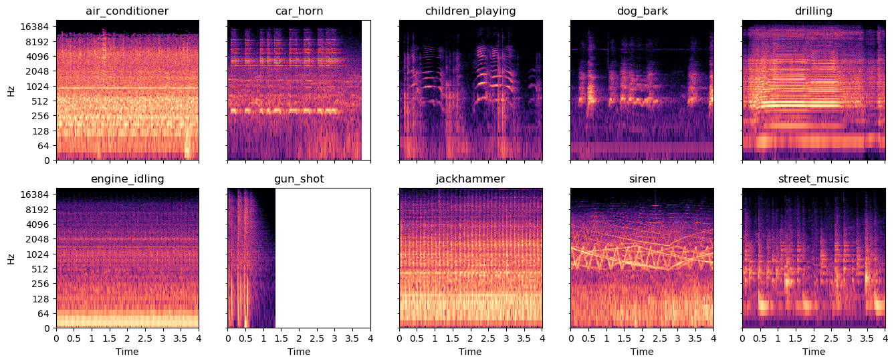{width=100%}

::: notes 

Classes from an urban sound taxonomy,
based on noise complains in New York city

Most sounds around 4 seconds. Some classes around 1 second

Foreground/background

:::

## Existing work

- Convolutional Neural Networks dominate
- Techniques come from image classification
- Mel-spectrogram input standard
- End2end models: getting close in accuracy
- "Edge ML" focused on mobile-phone class HW
- "Tiny ML" (sensors) just starting

::: notes

* Efficient Keyword-Spotting
* Efficient (image) CNNs
* Efficient ESC-CNN

ESC-CNN

* 23 papers reviewed in detail
* 10 referenced in thesis
* Only 4 consider computational efficiency

:::

## Model requirements

With 50% of STM32L476 capacity:

* 64 kB RAM
* 512 kB FLASH memory
* 4.5 M MACC/second

::: notes

* RAM: 1000x 64 MB
* PROGMEM: 1000x 512 MB
* CPU: 1000x 5 GFLOPS
* GPU: 1000'000X 5 TFLOPS

:::

## Existing models

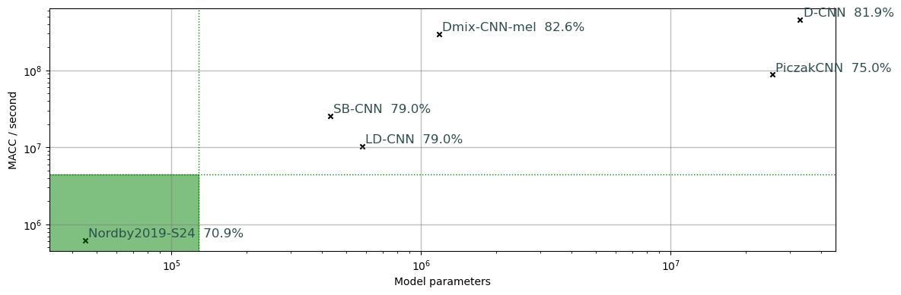{width=100%}

eGRU: running on ARM Cortex-M0 microcontroller, accuracy 61% with **non-standard** evaluation

::: notes

Assuming no overlap. Most models use very high overlap, 100X higher compute

:::

## Pipeline

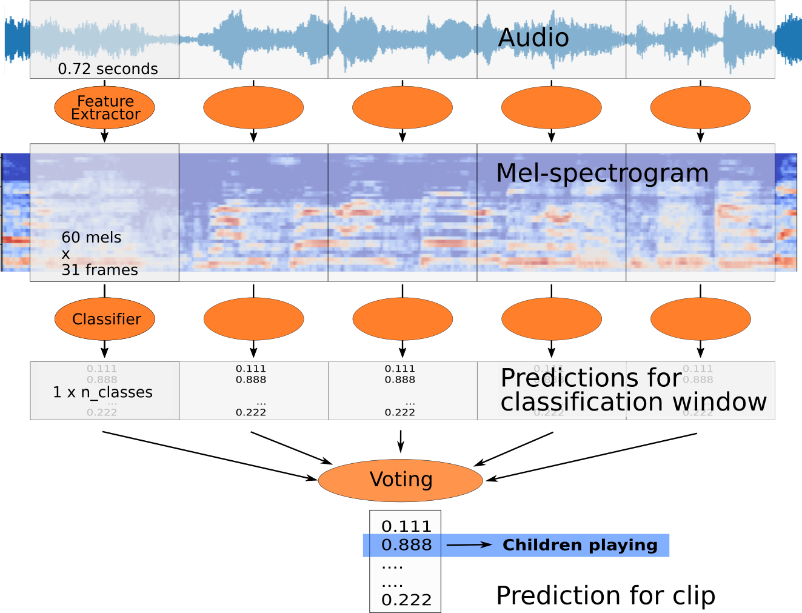{max-height=100%}

## Models

<!--
Based on SB-CNN (Salamon+Bello, 2016)
-->

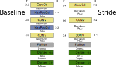{width=70%}

::: notes

Baseline from SB-CNN

Few modifications

* Uses smaller input feature representation
* Reduced downsample factor to accommodate

CONV = entry point for trying different convolution operators

:::

# Strategies for shrinking Convolutional Neural Network

## Reduce input dimensionality

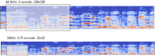{width=70%}

- Lower frequency range
- Lower frequency resolution
- Lower time duration in window
- Lower time resolution

::: notes

Directly limits time and RAM use first few layers.

Follow-on effects.
A simpler input representation is (hopefully) easier to learn
allowing for a simpler model

TODO: make a picture illustrating this

:::

## Reduce overlap

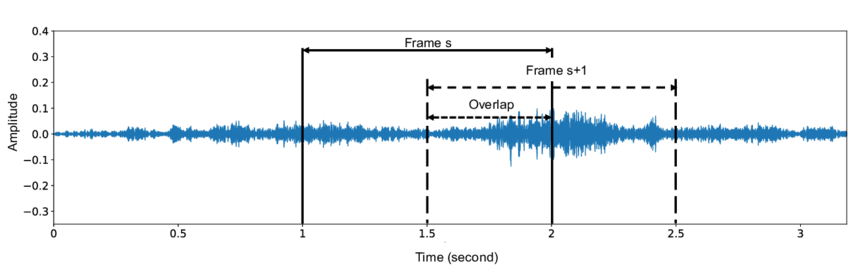{width=80%}

Models in literature use 95% overlap or more. 20x penalty in inference time!

Often low performance benefit. Use 0% (1x) or 50% (2x).

<!--
## Regular 2D-convolution

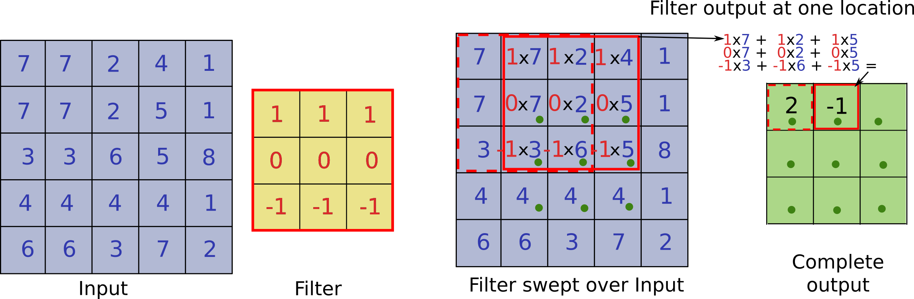{width=100%}

::: notes

TODO: illustrate the cubical nature. Many channel

:::
-->

## Depthwise-separable Convolution

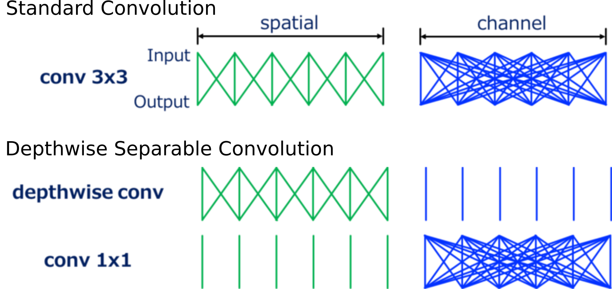{width=90%}

MobileNet, "Hello Edge", AclNet. 3x3 kernel,64 filters: 7.5x speedup
 
::: notes

* Much fewer operations
* Less expressive - but regularization effect can be beneficial

:::

## Spatially-separable Convolution

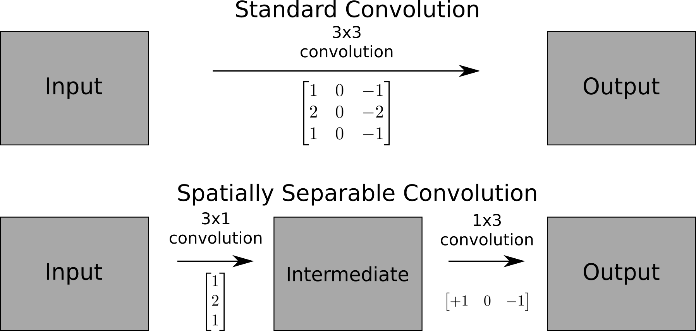{width=90%}

EffNet, LD-CNN. 5x5 kernel: 2.5x speedup

## Downsampling using max-pooling

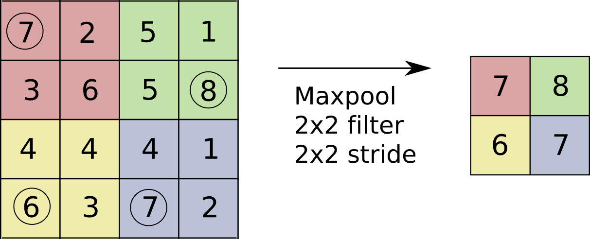{width=100%}

Wasteful? Computing convolutions, then throwing away 3/4 of results!

## Downsampling using strided convolution

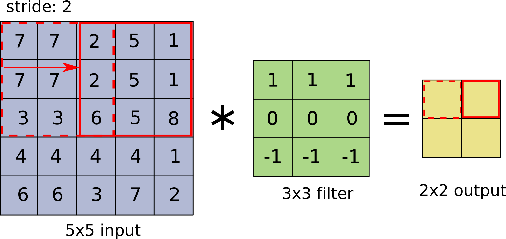{width=100%}

Striding means fewer computations and "learned" downsampling

## Model comparison

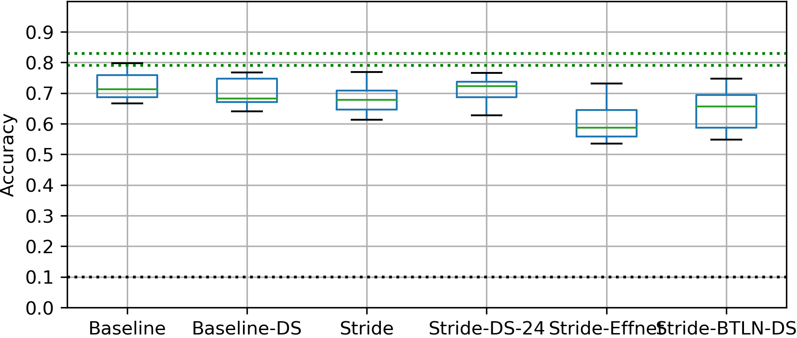{width=100%}

::: notes

- Baseline relative to SB-CNN and LD-CNN is down from 79% to 73%
Expected because poorer input representation.
Much lower overlap 

:::

## Performance vs compute

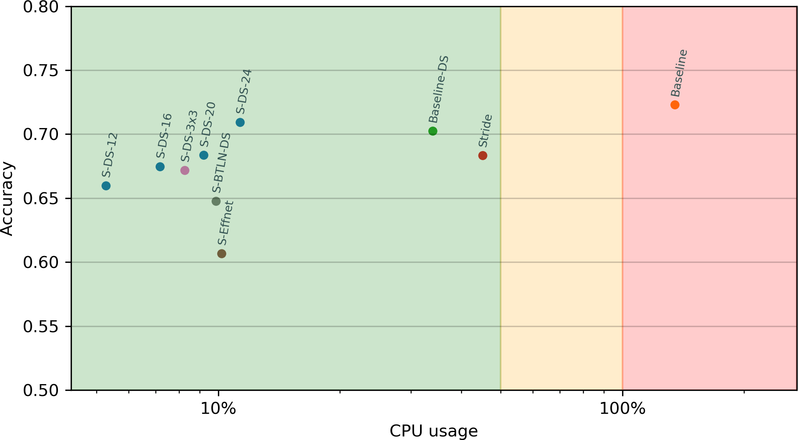{width=100%}

:::

- Performance of Strided-DS-24 similar to Baseline despite 12x the CPU use
- Suprising? Stride alone worse than Strided-DS-24
- Bottleneck and EffNet performed poorly
- Practical speedup not linear with MACC

:::

<!--

-->

## Quantization

Inference can often use 8 bit integers instead of 32 bit floats

- 1/4 the size for weights (FLASH) and activations (RAM) 
- 8bit **SIMD** on ARM Cortex M4F: 1/4 the inference time
- Supported in X-CUBE-AI 4.x (July 2019)

<!--

## Stronger training process 

- Data Augmentation. *Mixup*, *SpecAugment*
- Transfer Learning on more data. *AudioSet*

-->

::: notes

EnvNet-v2 got 78.3% on Urbansound8k with 16 kHz
:::

## Conclusions

- Able to perform Environmental Sound Classification at `~ 10mW` power,
- Using *general purpose microcontroller*, ARM Cortex M4F
- Best performance: 70.9% mean accuracy, under 20% CPU load
- Highest reported Urbansound8k on microcontroller (over eGRU 62%)
- Best architecture: Depthwise-Separable convolutions with striding
- Quantization enables 4x bigger models (and higher perf)
- With dedicated Neural Network Hardware

# Further Research

## Waveform input to model

- Preprocessing. Mel-spectrogram: **60** milliseconds
- CNN. Stride-DS-24: **81** milliseconds
- With quantization, spectrogram conversion is the bottleneck!
- Convolutions can be used to learn a Time-Frequency transformation.

Can this be faster than the standard FFT? And still perform well?

::: notes

- Especially interesting with CNN hardware acceleration.

:::

## On-sensor inference challenges

- Reducing power consumption. Adaptive sampling
- Efficient training data collection in WSN. Active Learning?
- Real-life performance evaluations. Out-of-domain samples

::: notes

TODO: Add few more projects here. From research document

:::

# Wrapping up

## Summary

- Noise pollution is a growing problem
- Wireless Sensor Networks can used to quantify
- Noise Classification can provide more information
- Want high density of sensors. Need to be low cost
- On-sensor classification desirable for power/cost and privacy

## More resources

Machine Hearing. ML on Audio

- [github.com/jonnor/machinehearing](https://github.com/jonnor/machinehearing)

Machine Learning for Embedded / IoT

- [github.com/jonnor/embeddedml](https://github.com/jonnor/embeddedml)

Thesis Report & Code

- [github.com/jonnor/ESC-CNN-microcontroller](https://github.com/jonnor/ESC-CNN-microcontroller)

## Questions

<h1 style="padding: 100px">?</h1>

Email: <jon@soundsensing.no>

## Come talk to me!

- Noise Monitoring sensors. Pilot projects for 2020?
- Environmental Sound, Wireless Sensor Networks for Audio. Research partnering?
- "On-edge" / Embedded Device ML. Happy to advise!

Email: <jon@soundsensing.no>

# Thesis results

## Model comparison

{width=100%}

::: notes

- Baseline relative to SB-CNN and LD-CNN is down from 79% to 73%
Expected because poorer input representation.
Much lower overlap 

:::

## List of results

{width=100%}

## Confusion

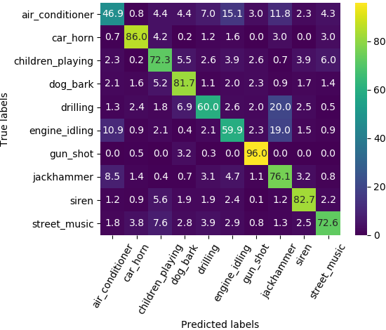{width=70%}

## Grouped classification

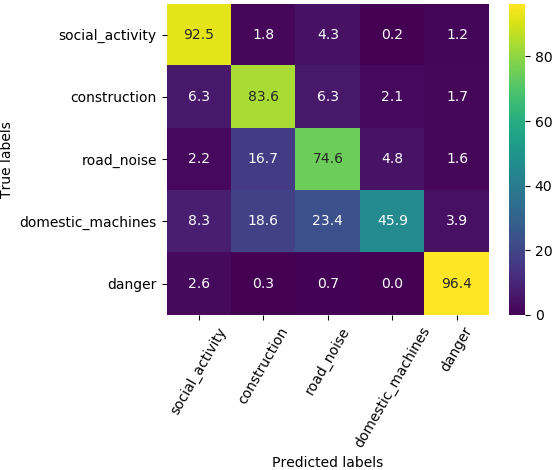{width=60%}

Foreground-only

## Unknown class

{width=100%}

::: notes

Idea: If confidence of model is low, consider it as "unknown"

* Left: Histogram of correct/incorrect predictions
* Right: Precision/recall curves
* Precision improves at expense of recall
* 90%+ precision possible at 40% recall

Usefulness:

* Avoids making decisions on poor grounds
* "Unknown" samples good candidates for labeling->dataset. Active Learning 
* Low recall not a problem? Data is abundant, 15 samples a 4 seconds per minute per sensor

:::

# Experimental Details

## All models

::: notes

* Baseline is outside requirements
* Rest fits the theoretical constraints
* Sometimes had to reduce number of base filters to 22 to fit in RAM

:::

# Methods

Standard procedure for Urbansound8k

- Classification problem
- 4 second sound clips
- 10 classes
- 10-fold cross-validation, predefined
- Metric: Accuracy

## Training settings

## Training

- NVidia RTX2060 GPU 6 GB
- 10 models x 10 folds = 100 training jobs
- 100 epochs
- 3 jobs in parallel
- 36 hours total

::: notes 

- ! GPU utilization only 15%
- CPU utilization was near 100%
- Larger models to utilize GPU better?
- Parallel processing limited by RAM of biggest models
- GPU-based augmentation might be faster

:::

## Evaluation

For each fold of each model

1. Select best model based on validation accuracy
2. Calculate accuracy on test set

For each model

- Measure CPU time on device

# Your model will trick you

And the bugs can be hard to spot

## FAIL: Integer truncation

{width=100%}

## FAIL. Dropout location

{width=100%}

# Background

## Mel-spectrogram

## Noise Pollution

Reduces health due to stress and loss of sleep

In Norway

* 1.9 million affected by road noise (2014, SSB)
* 10'000 healty years lost per year (Folkehelseinstituttet)

In Europe

* 13 million suffering from sleep disturbance (EEA)
* 900'000 DALY lost (WHO)

::: notes

1.9 million
https://www.ssb.no/natur-og-miljo/artikler-og-publikasjoner/flere-nordmenn-utsatt-for-stoy

1999: 1.2 million 

10 245 tapte friske leveår i Norge hvert år
https://www.miljostatus.no/tema/stoy/stoy-og-helse/

https://www.eea.europa.eu/themes/human/noise/noise-2

Burden of Disease WHO
http://www.euro.who.int/__data/assets/pdf_file/0008/136466/e94888.pdf

:::

## Noise Mapping

Simulation only, no direct measurements

::: notes

- Known sources
- Yearly average value
- Updated every 5 years
- Low data quality. Ex: communal roads

Image: https://www.regjeringen.no/no/tema/plan-bygg-og-eiendom/plan--og-bygningsloven/plan/kunnskapsgrunnlaget-i-planlegging/statistikk-i-plan/id2396747/

:::

