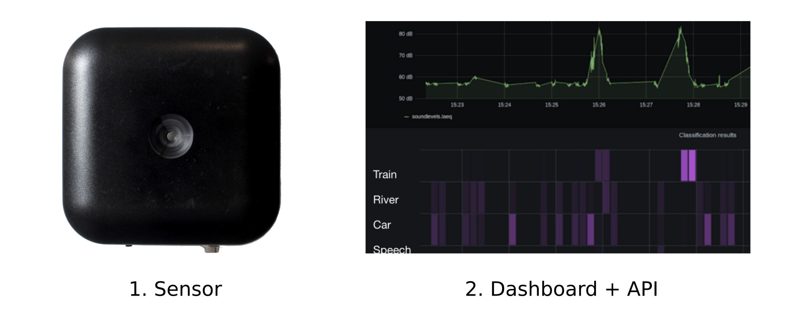
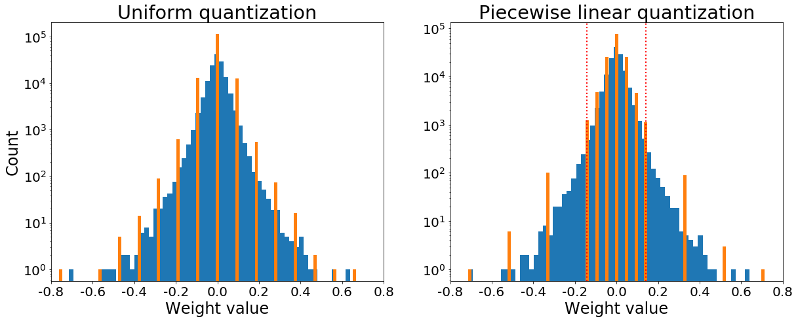
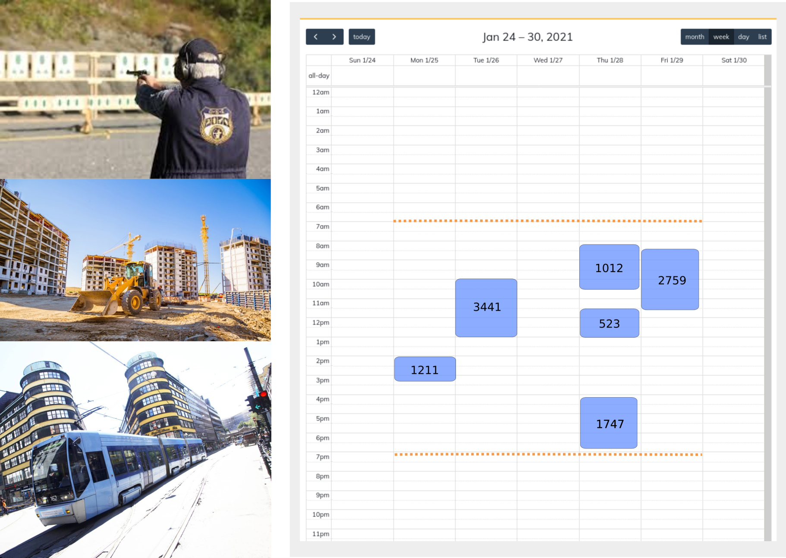
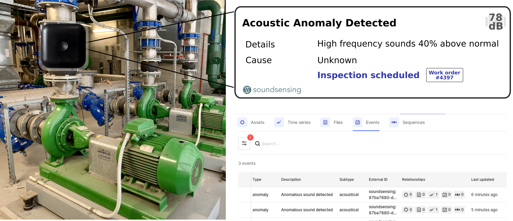

---
author: Jon Nordby <jon@soundsensing.no>
date: March 25, 2021
css: style.css
width: 1920
height: 1080
margin: 0
pagetitle: 'TinyML Summit 2021: Environmental Sound Classification on microcontrollers'
---

<section class="titleslide level1" data-background-image="./img/soundsensing-withlogo.jpg" style="background: rgba(255, 255, 255, 0.3); padding-top: 1.7em;" >

<h1 style="">Environmental Sound Classification on microcontrollers</h1>

Jon Nordby 
jon&#64;soundsensing.no 
tinyML Summit 2021 

</section>

# Introduction

::: notes

Environmental Sounds are sounds that we have around us in our environment,
especially outdoors.

It can be cars honking, music played from a club, speech from 

When environmental sounds are unwanted we call it environmental noise.

:::

## Environmental Noise Pollution

{width=50%}

The environmental pollution that affects most people in Europe

* 13 million suffering from sleep disturbance
* 900'000 disability-adjusted life years (DALY) lost

::: notes

Environmental Noise pollution is a big, and growing problem.
More and more we live in urban environments, with many noise sources around us.

WHO estimates that in Europe alone 13 million suffer from sleep distubance due to noise.
Such noise causes the body to be stressed, and in constant alert mode.
This increases risk of cardiovascuar disease, obesity etc.

And almost 1 million disability adjusted life years are lost due to noise.
This makes noise the environmental pollution that affects the most people in Europe.

:::

## Occupational Noise-induced Hearing Loss

{width=50%}

The most prevalent occupational disease in the world

* 40 million affected by hearing loss from work
* 4 million disability-adjusted life years (DALY) lost

::: notes

Another serious problem is hearing loss.

It is estimated that 40 million people are affected by hearing loss from work.

Affects workers across many industries,
including construction, manufacturing and shipping.

:::

## Noise Monitoring with Machine Learning

{width=100%}

::: notes

Soundsensing helps to address these issues by providing better tools
for monitoring noise, understanding the underlying causes, and what is needed to make improvements.

We provide easy-to-use IoT sensors that can continiously measure the noise-level,
as well as classify the dominant noise-source over time.

This is presented in our online dashboard,
and is also available in an API for integrating with other systems.

:::

## Wireless Audio Sensor Networks

{width=85%}

::: notes

Alternative A
would be to record audio in the sensor and transmit to the cloud.
This is a conceptually very simple solution,
and one could use a standard neural network in the cloud to do audio classification
without much computational constraints on the model.

However this would require a lot of data transfer,
which is costly in terms of energy and data traffic in a cellular 4G system.

It also would be very poor for privacy,
as potentially sensitive audio such as speech
would have to be transported through the network
and could potentially be stored in a server.

Alternative B would be to preprocess the data in the sensor, and classify this in the cloud.
Would have to reducing the data enough to be privacy friendly and save considerable data traffic,
but not so much as to reduce classification performance,
which can be a difficult trade-off.

But the best solution both for Privacy and Data Traffic would be the TinyML solution.
To do all the processing on the sensor, and only transmit data about the classes to server.

However this means the entire model needs to fit the constraints of the sensor device.

:::

## Model Constraints { data-background-image="./img/chip.jpg" }

<!--  <section class="level2" data-background="./img/chip.jpg"> 

<h2 style="">Device constraints</h2>
-->

Example target: STM32L476 microcontroller.
With 50% of capacity:

* 64 kB RAM 
* 512 kB FLASH memory 
* 4.5 M operations/second 

<!--  </section> -->

::: notes

If we consider a typical low-power microcontroller such as an ARM Cortex M4F,
and we dedicate 50% of the resources to the machine learning, that means

:::

## Small models Urbansound8K { data-background-image="" }

{width=100%}

::: notes

In work that we did in 2019, we found that existing models
were at 1-3 orders of magnitude too large to fit on device.

And we showed that one can reach about
10 percentage points from the unconstrainted State-of-the-Art models
when running on such a device.

We have since made several improvements to close the gap further,
but these are not published.

As far as I known this still is the best published performance on Urbansound8k

:::

# Shrinking   Convolutional Neural Networks  for TinyML Audio

How to did we make the model fit on device?

## Pipeline

{width=50%}

Typical audio pipeline. Spectrogram conversion, CNN on overlapped windows.

::: notes

Here is a typical audio classification pipeline.
The input audio is on the top.
It is chopped into fixed-length windows.
Then each audio window is converted to a spectrogram representation, usually Mel-spectrogram.
Each spectrogram window is fed to a classifier, typically a Convolutional Neural Network.
And if the sounds classes of interest is longer than the window length, one does some aggregation
to combine predictions for multiple windows into prediction for a single clip.

:::

## Reduce input dimensionality

{width=70%}

- Lower sample rate
- Lower frequency range
- Lower frequency resolution
- Lower time duration in window
- Lower time resolution

~10x reduction i compute. And easier to learn!

::: notes

The first optimizalization one can do is in preprocessing.
The key is to use a small input to the model as possible.
So if one reduces the sample rate, the range and resolution of frequencies bands,
the time duration and resolution of the window, one can make large gains.

Also makes it easier to learn with for small datasets!

:::

## Reduce overlap

{width=80%}

Models in literature use 95% overlap or more. 20x penalty in inference time!

Often small performance benefit. Use 0% (1x) or 50% (2x).

::: notes

Windows are computed with overlap
This gives the model a couple of different view of the same sound, which increases performance.
Typical SOTA models use maximum overlap, over repeating over 20x times on same audio section.

The performance benefit can however be quite minor. Try 1x, 2x, 4x first

Not that this increases detection latency and resolution.
Might not be limiting in some cases, like keyword spotting or event detection.

:::

## Use a small model!

<!--
Based on SB-CNN (Salamon+Bello, 2016)
-->

{width=70%}

::: notes

For many audio tasks one can get really far with a small model.
For example 2-4 convolutional layers followed by 2 dense layers
does well on a range of tasks.

One can start with a large model and then prune it,
but our experience start with small model is easier and works well.

:::

## Depthwise-separable Convolution

{width=90%}

MobileNet, "Hello Edge", AclNet. 3x3 kernel,64 filters: 7.5x speedup
 
::: notes

The convolutions in the network take up most of the CPU budget.

A Conv2d with multiple channels actually does convolution in 3 dimensions.
Width, height and channel.

This can be separated into two operations:
first convolution over spatial dimensions,
then convolve over the channel dimensions. 

5-10x speedups with very little performance impact
:::

## Downsampling using max-pooling

{width=100%}

Wasteful? Computing convolutions, then throwing away 3/4 of results!

::: notes

In a Convolutional Neural Network one downsamples the data as one gets deeper in layers,
to operate on progressively higher level features.
This is usually done by doing max pooling after each convolution,
which means to pick the highest value within the input.
However this is quite wasteful, as is disregards a lot of data computed by previous layer.

:::

## Downsampling using strided convolution

{width=100%}

"Learned" downsampling. Striding 2x2: Approx 4x speedup 

::: notes

An alternative is to drop the max pooling,
Instead use a stride higher than one in the convolution.
This reduces the amount of times the convolution is run.

Can sometimes perform better than max-pooling
Since the downsampling is included in the learned function! 

:::

## Quantization

{width=80%}

- Using int8 instead of float32.
- 4x improvement in weights (FLASH) and activations (RAM) 
- 4.6X improvement in runtime using CMSIS-NN *SIMD* 

Ref "CMSIS-NN: Efficient Neural Network Kernels for ARM Cortex-M CPUs"

::: notes

Quantizing down to 8 bit integers can be done almost without loss in performance.
4x improvement in FLASH and RAM

On Cortex M4F one can get around 4x improvement in CPU performance as well

:::

## Latest developments

* Binary network quantization 
* Neural Architecture Search
* Streaming inference
* Learned filterbanks
* Hardware acceleration
* Learned pooling

TinyML very actively researched, rapid improvements

::: notes

This area is very actively researched.
Many of these you will find dedicated talks about here at TinyML Summit.

:::

# Outro

## Noise Monitoring example

{width=50%}

* Based on Noise Event Detection & Classification
* Tested successfully at shooting range
* Expanding now to Construction and Industry noise

::: notes

Automatically creating a logbook of noisy training activities.

One of our customers operate a training facility for police special forces,
where they fire guns and conduct explosives training.
They use our system to have documentation that they follow the regulations,
and to verify any noise complains that come in.

We are now expanding this solution to other applications,
such as Construction, Industry and Transportation.

If you are working in these areas and interested in testing it out,
let us know.

:::

## Condition Monitoring example

{width=100%}

Condition Monitoring of technical equipment using sound. 
Developed based on experience from Noise Monitoring.

::: notes

We have also used the same techniques
to develop an Anomaly Detection system using sound,
which has been tested out on pumps.

This means that the condition of technical equipment
can be continiously monitored,
freeing up time for the janitors and providing better detection of issues.

We are currently looking to test this in larger
scale and on more types of machinery.

:::

## Conclusions

1. Audio classification of Environmental Noise can be done directly on sensor
2. Made possible with a range of efficient CNN techniques
3. Integrated into Soundsensing IoT sensors 
4. Used for Noise Monitoring & Condition Monitoring

## {data-background="./img/soundsensing-withlogo.jpg" style="background: rgba(255, 255, 255, 0.3);"}

We are open for partners and pilot projects 
Get in touch! 
contact@soundsensing.no 
 
 

<h1>Questions ?</h1>

<em>TinyML Summit 2021: Environmental Sound Classification on microcontrollers</em>

Jon Nordby
 jon&#64;soundsensing.no

# Bonus

Bonus slides after this point

# Thesis results

## All the info

> Thesis: Environmental Sound Classification
> on Microcontrollers
> using Convolutional Neural Networks

{width=30%}

## All models

::: notes

* Baseline is outside requirements
* Rest fits the theoretical constraints
* Sometimes had to reduce number of base filters to 22 to fit in RAM

:::

## Model comparison

{width=100%}

::: notes

- Baseline relative to SB-CNN and LD-CNN is down from 79% to 73%
Expected because poorer input representation.
Much lower overlap 

:::

## List of results

{width=100%}

## Confusion

{width=70%}

## Grouped classification

{width=60%}

Foreground-only

## Unknown class

{width=100%}

::: notes

Idea: If confidence of model is low, consider it as "unknown"

* Left: Histogram of correct/incorrect predictions
* Right: Precision/recall curves
* Precision improves at expense of recall
* 90%+ precision possible at 40% recall

Usefulness:

* Avoids making decisions on poor grounds
* "Unknown" samples good candidates for labeling->dataset. Active Learning 
* Low recall not a problem? Data is abundant, 15 samples a 4 seconds per minute per sensor

:::

# Thesis Methods

Standard procedure for Urbansound8k

- Classification problem
- 4 second sound clips
- 10 classes
- 10-fold cross-validation, predefined
- Metric: Accuracy

## Training settings

## Training

- NVidia RTX2060 GPU 6 GB
- 10 models x 10 folds = 100 training jobs
- 100 epochs
- 3 jobs in parallel
- 36 hours total

::: notes 

- ! GPU utilization only 15%
- CPU utilization was near 100%
- Larger models to utilize GPU better?
- Parallel processing limited by RAM of biggest models
- GPU-based augmentation might be faster

:::

## Evaluation

For each fold of each model

1. Select best model based on validation accuracy
2. Calculate accuracy on test set

For each model

- Measure CPU time on device

## Mel-spectrogram

## More resources

Machine Hearing. ML on Audio

- [github.com/jonnor/machinehearing](https://github.com/jonnor/machinehearing)

Machine Learning for Embedded / IoT

- [github.com/jonnor/embeddedml](https://github.com/jonnor/embeddedml)

Thesis Report & Code

- [github.com/jonnor/ESC-CNN-microcontroller](https://github.com/jonnor/ESC-CNN-microcontroller)

