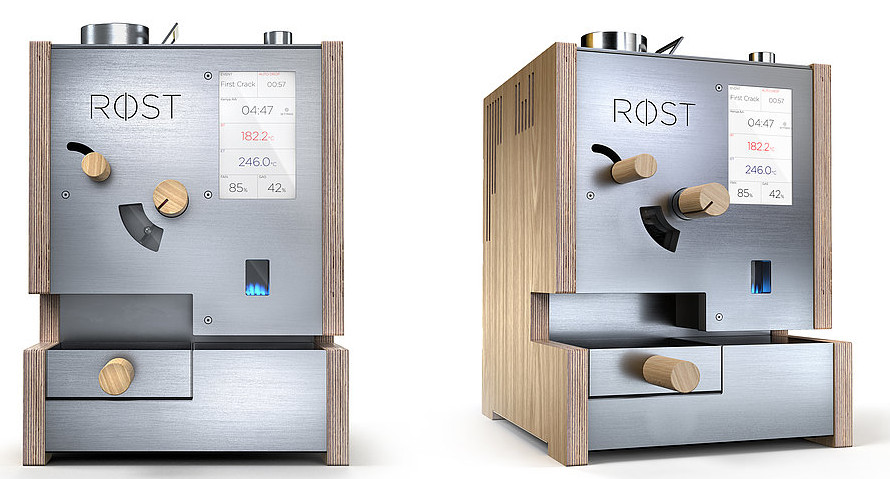
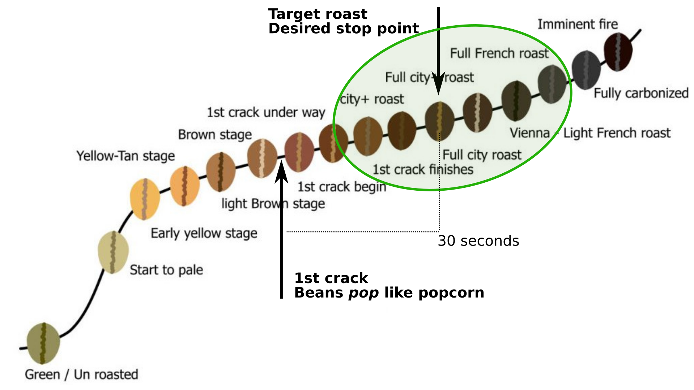
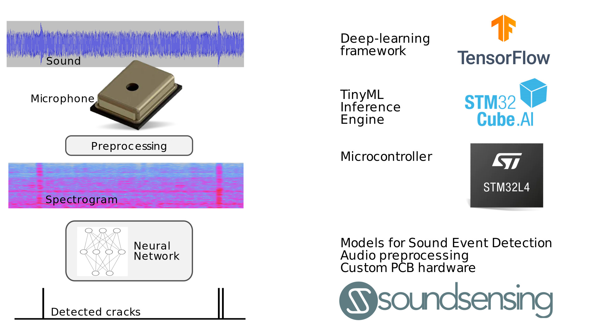

---
author: Jon Nordby <jon@soundsensing.no>
date: June 07, 2021
css: style.css
width: 1920
height: 1080
margin: 0
pagetitle: 'TinyML EMEA 2021: Perfect coffee roasting with TinyML sound sensing'
---

<section class="titleslide level1" data-background-image="./img/roest-soundsensing-cover.svg.jpg" style="background: rgba(255, 255, 255, 0.75); padding-top: 1.7em;" >

<h1 style="">Perfect coffee roasting  with TinyML sound sensing</h1>

<b>Jon Nordby 
jon&#64;soundsensing.no 
tinyML EMEA 2021 
</b>

</section>

<!-- A project that Soundsensing did for the company Roest. -->

## Roest

{width=70%}

::: notes

Lets anyone roast with digital precision

:::

## Soundsensing

::: notes

:::

## Roasting coffee

{width=70%}

::: notes

Needs to be very conscise.

Important is to stop the roasting at the right time
The best way is to wait for the 1st crack period to start
This is when the water in
and the beans pop like popcorn, making an audible sound

:::

## Doing it manually

{width=80%}

::: notes

Possible for skilled operator
Requires constant attention. 3 minute period
Variability between operators, over time

:::

## Automatic First Crack Detection

{width=80%}

::: notes

:::

## Demo video

<video class="r-stretch" data-autoplay src="./img/soundsensing-roest-simple-scappy1.mp4"></video>

::: notes

Benefits of automation

Much less skill required
Increased consistency
Operator can do other things while machine runs
Easy to operate multiple machines

Excellent results, consistently, automatically

:::

## {data-background="./img/roest-soundsensing-cover.svg.jpg" style="background: rgba(255, 255, 255, 0.75);"}

<h2>Want the worlds best coffee roaster?</h2>

<b>
 
<a href = "mailto:sales@roestcoffee.com">sales@roestcoffee.com</a>
 
 
</b>

::: notes

For your office, home, or local cafe

If you want the worlds most advanced coffe-roaster,
Contact Roest!

:::

## {data-background="./img/roest-soundsensing-cover.svg.jpg" style="background: rgba(255, 255, 255, 0.75);"}

<h2>Want to sense things using sound and machine learning?</h2>

<b>
 
<a href = "mailto:contact@soundsensing.no">contact@soundsensing.no</a>
 
 

<em>TinyML EMEA 2021: Perfect coffee roasting with TinyML sound sensing</em>

Jon Nordby
 jon&#64;soundsensing.no

</b>

::: notes

Have an sensing/monitoring problem that can be approached with sound?
In process-, manufacturing or other industries.
Contact Soundsensing!

:::

# Bonus

Bonus slides after this point

## More resources

Machine Hearing. ML on Audio

- [github.com/jonnor/machinehearing](https://github.com/jonnor/machinehearing)

Machine Learning for Embedded / IoT

- [github.com/jonnor/embeddedml](https://github.com/jonnor/embeddedml)

Thesis Report & Code

- [github.com/jonnor/ESC-CNN-microcontroller](https://github.com/jonnor/ESC-CNN-microcontroller)

