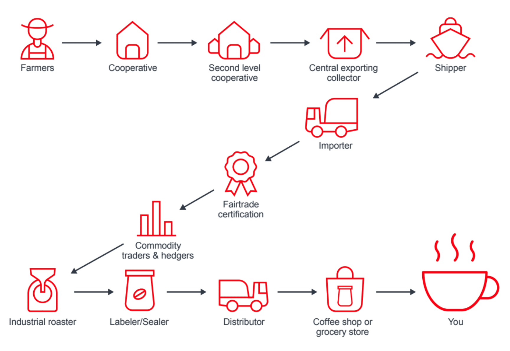

---
author: Jon Nordby <jon@soundsensing.no>
date: June 07, 2021
css: style.css
width: 1920
height: 1080
margin: 0
pagetitle: 'TinyML EMEA 2021: Perfect coffee roasting with TinyML sound sensing'
---

<section class="titleslide level1" data-background-image="./img/soundsensing-withlogo.jpg" style="background: rgba(255, 255, 255, 0.3); padding-top: 1.7em;" >

<h1 style="">Perfect coffee roasting  with TinyML sound sensing</h1>

Jon Nordby 
jon&#64;soundsensing.no 
tinyML EMEA 2021 

</section>

## Roest

::: notes

:::

## Soundsensing

::: notes

:::

## Sample roasting coffee

::: notes

:::

## First crack

::: notes

:::

## Video

<video data-autoplay src="./img/soundsensing-roest-simple-scappy1.mp4"></video>

::: notes

:::

## Want the worlds most advanced coffee roaster?

::: notes

For your office, home, or local cafe

If you want the worlds most advanced coffe-roaster,
Contact Roest!

:::

## {data-background="./img/soundsensing-withlogo.jpg" style="background: rgba(255, 255, 255, 0.3);"}

<h2>Want to sense things with sound?</h2>

 
contact@soundsensing.no 
 
 

<em>TinyML EMEA 2021: Perfect coffee roasting with TinyML sound sensing</em>

Jon Nordby
 jon&#64;soundsensing.no

::: notes

Have an sensing/monitoring problem that can be approached with sound?
In process-, manufacturing or other industries.
Contact Soundsensing!

:::

# Bonus

Bonus slides after this point

## More resources

Machine Hearing. ML on Audio

- [github.com/jonnor/machinehearing](https://github.com/jonnor/machinehearing)

Machine Learning for Embedded / IoT

- [github.com/jonnor/embeddedml](https://github.com/jonnor/embeddedml)

Thesis Report & Code

- [github.com/jonnor/ESC-CNN-microcontroller](https://github.com/jonnor/ESC-CNN-microcontroller)

